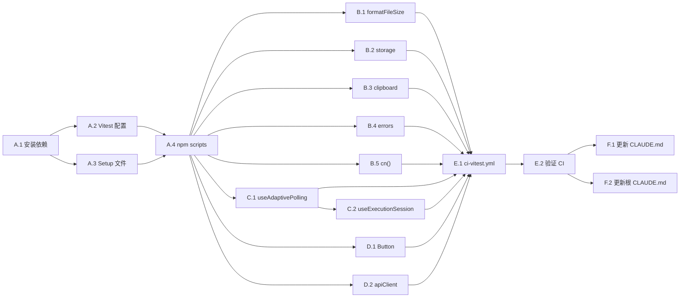

# 功能规划：Frontend 自动化测试框架引入

**规划时间**：2026-03-31 19:14:36（v2 精确版：基于源码逐行校准）
**预估工作量**：17 任务点
**分支**：refactor/model-capability-config-consistency

---

## 1. 功能概述

### 1.1 目标

为 Frontend 模块（Next.js 16 + React 19 + TypeScript）建立自动化测试基础设施，使 `pnpm test` 可一键运行测试，CI 中自动执行，且覆盖纯函数、自定义 Hook、UI 组件三种测试类型。

### 1.2 范围

**包含**：

- 测试框架选型、安装与配置（Vitest + Testing Library）
- vitest.config.ts 配置文件（适配 Next.js 16 + path alias + Tailwind）
- npm scripts 添加（test / test:watch / test:coverage / test:ci）
- 示例测试文件覆盖 4 个层次（纯函数 / Hook / UI 组件 / API 集成），共 9 个测试文件
- CI workflow 创建（ci-vitest.yml）
- CLAUDE.md 文档更新（根级 + frontend 模块级）

**不包含**：

- E2E 测试（Playwright/Cypress）-- 留给 Phase 2
- 不为全部 14 个 feature 模块编写完整测试覆盖 -- 仅提供示例和模式
- 不修改现有业务代码逻辑
- 不引入 Storybook 或视觉回归测试

### 1.3 技术约束

- **框架**：Next.js 16.1.1 (App Router) + React 19.2.3 + TypeScript 5
- **包管理器**：pnpm（已有 pnpm-lock.yaml）
- **路径别名**：`@/*` 映射到 `./*`（tsconfig.json paths 配置）
- **构建系统**：Next.js 内置 Turbopack（非 Vite），Vitest 需独立配置
- **UI 框架**：Tailwind CSS v4 + 80+ shadcn/ui 组件
- **Node.js**：CI 中使用 Node 20
- **已有 CI 步骤**：ESLint、Prettier、Build -- 测试步骤必须与这些共存

---

## 2. 技术选型依据

### 2.1 为什么选 Vitest 而非 Jest

| 维度                    | Vitest                                         | Jest                                   | 评判                                                             |
| ----------------------- | ---------------------------------------------- | -------------------------------------- | ---------------------------------------------------------------- |
| **Vite 原生兼容**       | 原生支持 ESM / TypeScript / JSX                | 需要 babel 或 ts-jest 转译             | Vitest 胜 -- 虽然 Next.js 用 Turbopack，Vitest 的 ESM 处理更简洁 |
| **配置复杂度**          | 与 Vite 共享配置或独立 vitest.config.ts        | 需要 jest.config + transform 配置      | Vitest 胜 -- 配置更少                                            |
| **速度**                | 基于/esbuild/vite 的原生 ESM 转换，冷启动快    | 基于 babel/ts-jest 转换，冷启动慢      | Vitest 胜                                                        |
| **Watch 模式**          | HMR 级别的 watch，毫秒级重跑                   | 文件变更后全量重跑                     | Vitest 胜                                                        |
| **React 19 支持**       | @testing-library/react 配合 vi.mock 无额外适配 | 需要 jest-environment-jsdom + 特殊配置 | Vitest 胜                                                        |
| **Next.js 生态**        | next-intl、next-themes 等库有 Vitest 示例      | 传统支持更广                           | 平手                                                             |
| **Coverage**            | 内置 c8/istanbul 覆盖率                        | 内置 istanbul 覆盖率                   | 平手                                                             |
| **TypeScript 路径别名** | 通过 vite-tsconfig-paths 或 resolve.alias      | 通过 moduleNameMapper                  | Vitest 配置更直观                                                |

**结论**：Vitest 在速度、配置简洁度、ESM 原生支持、React 19 兼容性上全面优于 Jest，且已成为 Next.js 社区推荐方案（Next.js 官方文档已提供 Vitest 集成指南）。

### 2.2 依赖清单

**devDependencies（新增）**：

| 包名                          | 版本  | 用途                                 |
| ----------------------------- | ----- | ------------------------------------ |
| `vitest`                      | ^3.x  | 测试框架核心                         |
| `@testing-library/react`      | ^16.x | React 组件渲染和查询                 |
| `@testing-library/jest-dom`   | ^6.x  | DOM 断言扩展（toBeInTheDocument 等） |
| `@testing-library/user-event` | ^14.x | 模拟用户交互事件                     |
| `jsdom`                       | ^25.x | 浏览器环境模拟                       |
| `vite-tsconfig-paths`         | ^5.x  | 解析 tsconfig.json 的 paths 别名     |
| `@vitejs/plugin-react`        | ^4.x  | Vitest 中 JSX/TSX 编译支持           |

---

## 3. WBS 任务分解

### 3.1 分解结构图

```mermaid
graph TD
    A["Frontend 自动化测试框架"] --> B["模块 A：基础设施配置"]
    A --> C["模块 B：纯函数单元测试"]
    A --> D["模块 C：自定义 Hook 测试"]
    A --> E["模块 D：UI 组件测试"]
    A --> F["模块 E：CI 集成"]
    A --> G["模块 F：文档更新"]

    B --> B1["A.1 安装依赖"]
    B --> B2["A.2 创建 vitest.config.ts"]
    B --> B3["A.3 创建测试 setup 文件"]
    B --> B4["A.4 添加 npm scripts"]

    C --> C1["B.1 formatFileSize 测试"]
    C --> C2["B.2 storage 工具测试"]
    C --> C3["B.3 clipboard 工具测试"]
    C --> C4["B.4 errors 错误处理测试"]
    C --> C5["B.5 cn() 工具函数测试"]

    D --> D1["C.1 useAdaptivePolling Hook 测试"]
    D --> D2["C.2 useExecutionSession Hook 测试"]

    E --> E1["D.1 Button 组件测试"]
    E --> E2["D.2 跨组件渲染测试"]

    F --> F1["E.1 创建 ci-vitest.yml"]
    F --> F2["E.2 验证 CI 完整流水线"]

    G --> G1["F.1 更新 frontend/CLAUDE.md"]
    G --> G2["F.2 更新根 CLAUDE.md"]
```



### 3.2 任务清单

---

#### 模块 A：基础设施配置（4 任务点）

##### 任务 A.1：安装测试依赖（1 点）

**文件**: `frontend/package.json`

- [ ] **任务 A.1**：安装 Vitest 及相关 devDependencies
  - **输入**：当前 package.json（无测试依赖）
  - **输出**：package.json 包含 7 个新 devDependency
  - **关键步骤**：
    1. 执行安装命令：
       ```bash
       pnpm --dir frontend add -D vitest @testing-library/react @testing-library/jest-dom @testing-library/user-event jsdom vite-tsconfig-paths @vitejs/plugin-react
       ```
    2. 确认 `pnpm-lock.yaml` 更新
    3. 验证安装成功：`pnpm --dir frontend exec vitest --version`

##### 任务 A.2：创建 Vitest 配置文件（1 点）

**文件**: `frontend/vitest.config.ts`（新建）

- [ ] **任务 A.2**：创建 vitest.config.ts，适配 Next.js 16 项目
  - **输入**：tsconfig.json（paths: `@/*` → `./*`）、现有 ESLint/TS 配置
  - **输出**：可用的 Vitest 配置
  - **关键配置项**：

    ```typescript
    import { defineConfig } from "vitest/config";
    import react from "@vitejs/plugin-react";
    import tsconfigPaths from "vite-tsconfig-paths";

    export default defineConfig({
      plugins: [react(), tsconfigPaths()],
      test: {
        // 浏览器环境模拟
        environment: "jsdom",
        // 全局 setup 文件
        setupFiles: ["./tests/setup.ts"],
        // 全局 API（describe/it/expect 无需 import）
        globals: true,
        // 包含的测试文件模式
        include: ["tests/**/*.test.{ts,tsx}", "features/**/*.test.{ts,tsx}"],
        // 排除目录
        exclude: ["node_modules", ".next", "dist"],
        // 覆盖率配置
        coverage: {
          provider: "istanbul",
          reporter: ["text", "lcov"],
          reportsDirectory: "./coverage",
          include: [
            "lib/**/*.ts",
            "features/*/hooks/*.ts",
            "features/*/services/*.ts",
          ],
          exclude: ["**/*.d.ts", "**/types/**"],
        },
        // CSS 模块处理（Tailwind）
        css: {
          modules: {
            classNameStrategy: "non-scoped",
          },
        },
      },
    });
    ```

  - **注意事项**：
    - `vite-tsconfig-paths` 确保 `@/` 别名在测试中正常解析
    - `css.modules.classNameStrategy: "non-scoped"` 避免 Tailwind 类名被 hash 化
    - `globals: true` 使 `describe`/`it`/`expect` 全局可用，与 Jest 体验一致

##### 任务 A.3：创建测试 setup 文件（1 点）

**文件**: `frontend/tests/setup.ts`（新建）

- [ ] **任务 A.3**：创建全局 setup 文件，扩展 DOM 断言和 mock 常见浏览器 API
  - **输入**：@testing-library/jest-dom 扩展、浏览器 API 依赖分析
  - **输出**：setup.ts 提供 clean testing environment
  - **关键内容**：

    ```typescript
    import "@testing-library/jest-dom/vitest";

    // Mock Next.js navigation
    vi.mock("next/navigation", () => ({
      useRouter: () => ({
        push: vi.fn(),
        replace: vi.fn(),
        back: vi.fn(),
        forward: vi.fn(),
        refresh: vi.fn(),
        prefetch: vi.fn(),
      }),
      usePathname: () => "/",
      useSearchParams: () => new URLSearchParams(),
      useParams: () => ({}),
    }));

    // Mock next-themes
    vi.mock("next-themes", () => ({
      useTheme: () => ({ theme: "light", setTheme: vi.fn() }),
    }));

    // Mock sonner toast
    vi.mock("sonner", () => ({
      toast: { success: vi.fn(), error: vi.fn(), info: vi.fn() },
    }));

    // Mock matchMedia (jsdom 不支持)
    Object.defineProperty(window, "matchMedia", {
      writable: true,
      value: vi.fn().mockImplementation((query: string) => ({
        matches: false,
        media: query,
        onchange: null,
        addListener: vi.fn(),
        removeListener: vi.fn(),
        addEventListener: vi.fn(),
        removeEventListener: vi.fn(),
        dispatchEvent: vi.fn(),
      })),
    });

    // Mock IntersectionObserver (Radix UI 组件需要)
    class MockIntersectionObserver {
      observe = vi.fn();
      disconnect = vi.fn();
      unobserve = vi.fn();
    }
    Object.defineProperty(window, "IntersectionObserver", {
      writable: true,
      value: MockIntersectionObserver,
    });

    // Mock ResizeObserver
    class MockResizeObserver {
      observe = vi.fn();
      disconnect = vi.fn();
      unobserve = vi.fn();
    }
    Object.defineProperty(window, "ResizeObserver", {
      writable: true,
      value: MockResizeObserver,
    });

    // Mock scrollTo
    Object.defineProperty(window, "scrollTo", {
      writable: true,
      value: vi.fn(),
    });

    // Mock HTMLDialogElement (Radix Dialog 需要)
    HTMLDialogElement.prototype.show = vi.fn();
    HTMLDialogElement.prototype.showModal = vi.fn();
    HTMLDialogElement.prototype.close = vi.fn();
    ```

  - **注意事项**：
    - `next/navigation` mock 解决 App Router API 在 jsdom 中不可用的问题
    - `matchMedia`、`IntersectionObserver`、`ResizeObserver` 是 shadcn/ui / Radix UI 组件的常见依赖
    - 后续可按需在具体测试文件中覆盖这些全局 mock

##### 任务 A.4：添加 npm scripts（0.5 点）

**文件**: `frontend/package.json`

- [ ] **任务 A.4**：在 scripts 中添加测试相关命令
  - **输入**：当前 scripts（dev / build / start / lint / format）
  - **输出**：新增 4 个 test scripts
  - **关键步骤**：
    1. 在 `package.json` 的 `scripts` 中添加：
       ```json
       {
         "test": "vitest run",
         "test:watch": "vitest",
         "test:coverage": "vitest run --coverage",
         "test:ci": "vitest run --reporter=json --reporter=default"
       }
       ```
    2. 验证 `pnpm --dir frontend test` 可正常执行（即使 0 个测试文件也不应报错）

> **注**：`frontend/.gitignore` 已包含 `/coverage` 条目，无需额外修改。

---

#### 模块 B：纯函数单元测试（4 任务点）

##### 任务 B.1：formatFileSize 测试（0.5 点）

**文件**: `frontend/tests/lib/utils/file/format-file-size.test.ts`（新建）
**源文件**: `frontend/lib/utils/file/format-file-size.ts`

- [ ] **任务 B.1**：为 `formatFileSize` 编写测试
  - **源码签名**：`export function formatFileSize(bytes: number): string`
  - **实现要点**：`if (bytes === 0) return "0 B"` → `Math.floor(Math.log(bytes) / Math.log(1024))` → `toFixed(1)`
  - **测试用例**（8 个）：
    | 用例 | 输入 | 预期输出 | 说明 |
    |------|------|----------|------|
    | 零字节 | `0` | `"0 B"` | 提前返回分支 |
    | 单字节 | `1` | `"1 B"` | `Math.log(1)=0` → `i=0` |
    | KB 边界 | `1024` | `"1 KB"` | `Math.log(1024)/Math.log(1024)=1` → `i=1` |
    | MB 大小 | `1048576` | `"1 MB"` | `i=2` |
    | GB 大小 | `1073741824` | `"1 GB"` | `i=3` |
    | TB 大小 | `1099511627776` | `"1 TB"` | `i=4` |
    | 小数精度 | `1536` | `"1.5 KB"` | `toFixed(1)` 验证 |
    | 非整数值 | `2500` | `"2.4 KB"` | `(2500/1024).toFixed(1)=2.4` |

##### 任务 B.2：storage 工具测试（1 点）

**文件**: `frontend/tests/lib/utils/storage.test.ts`（新建）
**源文件**: `frontend/lib/utils/storage.ts`

- [ ] **任务 B.2**：为 storage 工具编写测试
  - **源码签名**：
    - `getLocalStorage<T>(key: LocalStorageKey): T | null`
    - `setLocalStorage<T>(key: LocalStorageKey, value: T): void`
    - `removeLocalStorage(key: LocalStorageKey): void`
    - `clearLocalStorage(): void` — 仅清除 `poco_` 前缀条目
    - `getSessionStorage<T>(key: SessionStorageKey): T | null`
    - `setSessionStorage<T>(key: SessionStorageKey, value: T): void`
    - `removeSessionStorage(key: SessionStorageKey): void`
  - **内部实现要点**：
    - 所有 key 自动加前缀 `poco_`（`PREFIX = "poco_"`）
    - 内部 `getStorage()` 在 `typeof window === "undefined"` 时返回 `undefined`
    - `getItem<T>()` 用 `JSON.parse` 解析，catch 时返回 `null`
    - `setItem<T>()` 用 `JSON.stringify` 序列化
  - **测试用例**（12+）：
    - `setLocalStorage` + `getLocalStorage` — 正常 CRUD、key 前缀 `poco_` 验证
    - `getLocalStorage` — 空 key 返回 `null`、损坏 JSON 返回 `null`
    - `removeLocalStorage` — 删除后 get 返回 `null`
    - `clearLocalStorage` — 仅清除 `poco_` 前缀条目，保留其他 key
    - `setSessionStorage` + `getSessionStorage` + `removeSessionStorage` — 同上模式
    - SSR：`vi.stubGlobal("window", undefined)` 后 get 返回 `null`、set/remove 不报错

##### 任务 B.3：clipboard 工具测试（1 点）

**文件**: `frontend/tests/lib/utils/clipboard/copy-to-clipboard.test.ts`（新建）
**源文件**: `frontend/lib/utils/clipboard/copy-to-clipboard.ts`

- [ ] **任务 B.3**：为 clipboard 工具编写测试
  - **源码签名**：
    - `copyToClipboard(text: string, options?: { onSuccess?: () => void; onError?: (error: Error) => void }): Promise<boolean>`
    - `readFromClipboard(): Promise<string | null>`
  - **实现要点**：
    - SSR 检查：`typeof window === "undefined"` → 直接返回 `false` / `null`
    - 优先尝试 `navigator.clipboard.writeText`（需要 `window.isSecureContext`）
    - Fallback：创建隐藏 `<textarea>` → `document.execCommand("copy")` → 移除
    - `readFromClipboard`：无 Clipboard API 或非安全上下文时返回 `null`
  - **测试用例**（10+）：
    - Clipboard API 成功 → `onSuccess` 触发 → 返回 `true`
    - Clipboard API 不存在（`isSecureContext=false`）→ fallback execCommand 成功
    - Clipboard API + execCommand 均失败 → `onError` 触发 → 返回 `false`
    - SSR → 返回 `false`
    - `readFromClipboard` 成功读取
    - `readFromClipboard` 非 `isSecureContext` → 返回 `null`
  - **Mock 策略**：`vi.spyOn(navigator, "clipboard", "get")` + `vi.spyOn(document, "execCommand")`

##### 任务 B.4：errors 错误处理测试（1 点）

**文件**: `frontend/tests/lib/errors/error-handler.test.ts`（新建）
**源文件**: `frontend/lib/errors/app-error.ts` + `frontend/lib/errors/error-handler.ts`

- [ ] **任务 B.4**：为错误处理模块编写测试
  - **源码签名**（app-error.ts）：
    - `AppError(message, code, statusCode=400)` — `.toJSON()` → `{ name, code, message, statusCode }`
    - `NetworkError(message, statusCode?)` — code=`"NETWORK_ERROR"`, statusCode=`503`
    - `ApiError(message, statusCode, details?)` — code=`"API_ERROR"`
    - `ValidationError(message, field?)` — code=`"VALIDATION_ERROR"`, statusCode=`400`
    - `AuthenticationError(message?)` — code=`"AUTH_ERROR"`, statusCode=`401`
    - `AuthorizationError(message?)` — code=`"AUTHZ_ERROR"`, statusCode=`403`
    - `NotFoundError(resource?)` — code=`"NOT_FOUND"`, statusCode=`404`
    - `RateLimitError(message?)` — code=`"RATE_LIMIT_ERROR"`, statusCode=`429`
    - `ErrorCodes` 常量对象（13 个 key）
  - **源码签名**（error-handler.ts）：
    - `parseApiError(error, defaultMessage?)` → `AppError`
    - `getErrorMessage(error)` → `string`
    - `logError(error, context?)` → `void`（`import.meta.env.DEV` 时 console.error）
    - `handleError(error, options?)` → `AppError`
    - `isAppError(error)` → `error is AppError`
    - `retryWithBackoff<T>(fn, options?)` → `Promise<T>`（默认重试 NetworkError + RateLimitError）
  - **测试用例**（16+）：
    - **AppError 类族**（5 用例）：
      - AppError 构造函数 + toJSON()
      - 继承链：`NetworkError instanceof AppError` 为 true
      - ApiError 额外属性 `details`
      - RateLimitError 默认 message="Rate limit exceeded"
      - ErrorCodes 常量完整性（至少 13 个 key）
    - **parseApiError**（4 用例）：
      - 传入 AppError 直接返回同一实例
      - 传入 `{ code: 400, message: "bad" }` → ApiError(code=400)
      - 传入 `new TypeError("fetch failed")` → NetworkError
      - 传入普通 Error → AppError(code="UNKNOWN_ERROR")
    - **retryWithBackoff**（3 用例）：
      - 首次成功不重试
      - NetworkError 触发重试并最终成功
      - 达到 maxRetries 后抛出最后一个错误
    - **辅助函数**（4 用例）：
      - getErrorMessage(AppError) → error.message
      - getErrorMessage("string") → "An unexpected error occurred"
      - isAppError(new AppError(...)) → true / isAppError(new Error) → false
      - logError 在 DEV 环境调用 console.error

##### 任务 B.5：cn() 工具函数测试（0.5 点）

**文件**: `frontend/tests/lib/utils/cn.test.ts`（新建）

- [ ] **任务 B.5**：为 `lib/utils.ts` 的 `cn()` 编写测试
  - **输入**：`cn(...inputs: ClassValue[]): string`
  - **输出**：6 测试用例
  - **测试用例**：
    - 合并多个类名：`cn("a", "b")` → `"a b"`
    - 条件类名：`cn("a", false && "b", "c")` → `"a c"`
    - Tailwind 冲突合并：`cn("px-4", "px-6")` → `"px-6"`（tailwind-merge 功能）
    - 空输入：`cn()` → `""`
    - undefined/null 处理：`cn("a", undefined, null)` → `"a"`

---

#### 模块 C：自定义 Hook 测试（4 任务点）

##### 任务 C.1：useAdaptivePolling Hook 测试（2 点）

**文件**: `frontend/tests/features/chat/hooks/use-adaptive-polling.test.ts`（新建）
**源文件**: `frontend/features/chat/hooks/use-adaptive-polling.ts`

- [ ] **任务 C.1**：为 useAdaptivePolling 编写测试
  - **源码签名**：`useAdaptivePolling(options: AdaptivePollingOptions): AdaptivePollingReturn`
  - **Options**: `{ callback, isActive, interval?, minInterval?, maxInterval?, backoffMultiplier?, enableBackoff?, maxErrors? }`
  - **Return**: `{ currentInterval, errorCount, isPolling, trigger, resetInterval }`
  - **实现要点**：
    - 内部 `useRef<NodeJS.Timeout>` 管理定时器
    - `trigger()` 成功后调用 `setErrorCount(0)` + `setCurrentInterval(interval)`
    - `trigger()` 失败后 `setErrorCount(prev => prev+1)` + `setCurrentInterval(prevInterval * backoffMultiplier)`
    - `resetInterval()` 重置为初始 `interval` 和 `errorCount=0`
    - `useEffect` 依赖 `[isActive, currentInterval, trigger]`
  - **测试用例**（12+），使用 `renderHook` + `vi.useFakeTimers()`：
    - **初始状态**（2）：默认 `currentInterval=3000`、`errorCount=0`、`isPolling=false`
    - **正常轮询**（2）：`isActive=true` + `advanceTimersByTime(interval)` → callback 被调用；`isActive` 变 false → 停止
    - **指数退避**（3）：callback throw → `errorCount=1`、`currentInterval=prev*backoffMultiplier`；连续错误 → 持续增长；成功后 → `resetInterval`
    - **resetInterval**（1）：手动重置到初始值
    - **手动触发**（1）：`trigger()` 异步调用 callback
    - **边界条件**（3）：`maxInterval` 上限不超限；`maxErrors` 达到后停止退避（不再增大 interval）；`minInterval` 下限

##### 任务 C.2：useExecutionSession Hook 测试（2 点）

**文件**: `frontend/tests/features/chat/hooks/use-execution-session.test.ts`（新建）
**源文件**: `frontend/features/chat/hooks/use-execution-session.ts`

- [ ] **任务 C.2**：为 useExecutionSession 编写测试
  - **源码签名**：`useExecutionSession(options: UseExecutionSessionOptions): UseExecutionSessionReturn`
  - **Options**: `{ sessionId, pollingInterval?, enableBackoff?, onPollingStop? }`
  - **Return**: `{ session, isLoading, error, pollingInterval, errorCount, refetch, updateSession }`
  - **关键依赖**（需 mock）：
    - `getExecutionSessionAction` from `@/features/chat/actions/query-actions` — 返回 `ExecutionSession`
    - `useAdaptivePolling` — 返回 `{ currentInterval, errorCount, trigger, resetInterval }`
    - `playCompletionSound` from `@/lib/utils/sound`
    - `localStorage.getItem("session_prompt_${sessionId}")`
  - **测试用例**（8+）：
    - **初始加载**（2）：渲染后 `isLoading=true`；fetchSession 成功后 `session` 更新、`isLoading=false`
    - **轮控行为**（2）：`session.status="running"` → `isSessionActive=true` → 轮询继续；`session.status="completed"` → `isSessionActive=false` → 停止
    - **状态更新**（2）：`updateSession({ title: "new" })` 正确合并；`user_prompt` 在合并中保持不变
    - **错误处理**（2）：fetchSession 抛错 → `error` 非空；`sessionId` 变化 → 全部状态重置
  - **Mock 策略**：
    - `vi.mock("@/features/chat/actions/query-actions")` — mock `getExecutionSessionAction`
    - `vi.mock("@/lib/utils/sound")` — mock `playCompletionSound`
    - `vi.mock("./use-adaptive-polling")` — mock `useAdaptivePolling` 返回可控对象
    - 使用 `waitFor` + `act` 处理异步状态更新

---

#### 模块 D：UI 组件测试（3 任务点）

##### 任务 D.1：Button 组件测试（2 点）

**文件**: `frontend/tests/components/ui/button.test.tsx`（新建）
**源文件**: `frontend/components/ui/button.tsx`

- [ ] **任务 D.1**：为 Button 编写测试
  - **源码签名**：`Button(props: React.ComponentProps<"button"> & VariantProps<typeof buttonVariants> & { asChild?: boolean })`
  - **Props**: `variant` / `size` / `asChild` / `className` / `onClick` / `disabled` + 所有原生 button props
  - **Variants**（6 个）：
    | variant | 关键 CSS 类 |
    |---------|-------------|
    | `default` | `bg-primary text-primary-foreground hover:bg-primary/90` |
    | `destructive` | `bg-destructive text-white hover:bg-destructive/90` |
    | `outline` | `border bg-background shadow-xs` |
    | `secondary` | `bg-secondary text-secondary-foreground` |
    | `ghost` | `hover:bg-accent hover:text-accent-foreground` |
    | `link` | `text-primary underline-offset-4 hover:underline` |
  - **Sizes**（6 个）：
    | size | 关键 CSS 类 |
    |------|-------------|
    | `default` | `h-9 px-4 py-2` |
    | `sm` | `h-8 rounded-md gap-1.5 px-3` |
    | `lg` | `h-10 rounded-md px-6` |
    | `icon` | `size-9` |
    | `icon-sm` | `size-8` |
    | `icon-lg` | `size-10` |
  - **测试用例**（10+）：
    - **渲染**（3）：`data-slot="button"` 存在；children 正确；默认 `data-variant="default"` + `data-size="default"`
    - **Variant**（2）：`destructive` 含 `bg-destructive`；`outline` 含 `border`
    - **Size**（2）：`sm` 含 `h-8`；`icon` 含 `size-9`
    - **asChild**（1）：`asChild=true` + `<a>` 子元素 → 渲染为 `<a>` 而非 `<button>`
    - **交互**（2）：`onClick` 触发；`disabled` 不可点击

##### 任务 D.2：apiClient 集成测试（1 点）

**文件**: `frontend/tests/integration/api-client.test.ts`（新建）
**源文件**: `frontend/services/api-client.ts`

- [ ] **任务 D.2**：为 api-client 编写集成测试
  - **源码关键导出**：
    - `API_PREFIX = "/api/v1"`
    - `API_ENDPOINTS` — 80+ 端点常量（静态字符串 + 工厂函数）
    - `getApiBaseUrl(): string` — 浏览器返回 `NEXT_PUBLIC_API_URL || ""`；服务端从 `BACKEND_URL` 读取
    - `apiFetch<T>(endpoint, options?): Promise<T>` — 核心 fetch wrapper
    - `apiClient.get/post/patch/put/delete` — 便捷方法
  - **内部实现要点**：
    - `resolveAuthToken()` — 客户端从 `localStorage` 读 token；服务端从 `next/headers` cookies 读
    - `normalizeBody()` — `string | FormData` 直接传；其余 `JSON.stringify`
    - Content-Type：非 FormData 自动加 `application/json`
    - Timeout：默认 60s，内部 `AbortController`
    - Envelope 解包：`{ code, message, data }` → 只返回 `data`
    - 错误：`!response.ok` → `ApiError(message, status, payload)`；AbortError → `ApiError("Request timeout", 408)`
  - **测试用例**（10+）：
    - **getApiBaseUrl**（3）：
      - 浏览器 + `NEXT_PUBLIC_API_URL="http://api.test"` → 返回配置值（无尾部 `/`）
      - 浏览器 + 无 `NEXT_PUBLIC_API_URL` → 返回 `""`
      - 服务端无 `BACKEND_URL` → throw ApiError(500)
    - **apiFetch 请求构造**（3）：
      - URL 拼接：`getApiBaseUrl() + "/api/v1" + endpoint`
      - 自动 `Content-Type: application/json`（非 FormData）
      - FormData 请求不设置 Content-Type
    - **Envelope 解包**（2）：
      - `{ code: 200, data: { id: 1 } }` → 返回 `{ id: 1 }`
      - `{ code: 500, message: "fail" }` → throw ApiError
    - **错误处理**（2）：
      - HTTP 404 → `ApiError("Not Found", 404)`
      - `AbortError` → `ApiError("Request timeout", 408)`
  - **Mock 策略**：`vi.stubGlobal("fetch", vi.fn())` — mock 全局 fetch

---

#### 模块 E：CI 集成（2 任务点）

##### 任务 E.1：创建 ci-vitest.yml（1.5 点）

**文件**: `.github/workflows/ci-vitest.yml`（新建）

- [ ] **任务 E.1**：创建 Vitest CI workflow，与现有 CI 流水线风格保持一致
  - **输入**：ci-frontend-build.yml 和 ci-eslint.yml（复用触发条件和步骤模式）
  - **输出**：ci-vitest.yml 工作流文件
  - **关键内容**：

    ```yaml
    name: CI Vitest

    on:
      pull_request:
        paths:
          - "frontend/**"
          - ".github/workflows/ci-vitest.yml"
      push:
        branches:
          - main
        paths:
          - "frontend/**"
          - ".github/workflows/ci-vitest.yml"
      workflow_dispatch:

    permissions:
      contents: read

    jobs:
      test:
        runs-on: ubuntu-latest
        steps:
          - name: Checkout
            uses: actions/checkout@v4

          - name: Setup pnpm
            uses: pnpm/action-setup@v4
            with:
              version: 9
              run_install: false

          - name: Setup Node.js
            uses: actions/setup-node@v4
            with:
              node-version: "20"
              cache: pnpm
              cache-dependency-path: frontend/pnpm-lock.yaml

          - name: Install dependencies
            run: pnpm --dir frontend install --frozen-lockfile

          - name: Run tests
            run: pnpm --dir frontend test:ci

          - name: Upload coverage
            if: always()
            uses: actions/upload-artifact@v4
            with:
              name: coverage-report
              path: frontend/coverage/
              retention-days: 7
    ```

  - **注意事项**：
    - `paths` 过滤与 ci-eslint.yml 保持一致
    - `if: always()` 确保覆盖率报告即使测试失败也上传
    - 使用 `test:ci` 命令（含 JSON reporter，方便后续集成测试结果展示）

##### 任务 E.2：验证 CI 完整流水线（0.5 点）

- [ ] **任务 E.2**：本地验证 CI 流水线逻辑正确性
  - **输入**：ci-vitest.yml + 已有测试文件
  - **输出**：验证通过
  - **关键步骤**：
    1. 本地运行 `pnpm --dir frontend test:ci`，确认 JSON 报告生成
    2. 确认 coverage 目录生成
    3. 确认现有 `pnpm build` 和 `pnpm lint` 不受影响
    4. （推送到 PR 后）确认 GitHub Actions 正确触发

---

#### 模块 F：文档更新（1 任务点）

##### 任务 F.1：更新 frontend/CLAUDE.md（0.5 点）

**文件**: `frontend/CLAUDE.md`

- [ ] **任务 F.1**：在 "Testing and Quality" 章节补充测试相关信息
  - **输入**：当前 CLAUDE.md（标注 "No automated tests configured currently"）
  - **输出**：更新后的文档
  - **修改内容**：
    1. 将 "No automated tests configured currently" 替换为：
       ```
       - **Framework**: Vitest 3.x + @testing-library/react + jsdom
       - **Commands**:
         - `pnpm test` -- Run all tests
         - `pnpm test:watch` -- Watch mode
         - `pnpm test:coverage` -- Generate coverage report
         - `pnpm test:ci` -- CI mode with JSON reporter
       - **Config**: `vitest.config.ts`
       - **Setup**: `tests/setup.ts` (global mocks)
       - **Test location**: `tests/**/*.test.{ts,tsx}`
       ```
    2. 在 "Frontend Quality Gates" 中增加：`pnpm test` must pass

##### 任务 F.2：更新根 CLAUDE.md（0.5 点）

**文件**: `CLAUDE.md`（项目根目录）

- [ ] **任务 F.2**：更新 Testing Strategy 表格和 CI Pipeline 章节
  - **输入**：当前 CLAUDE.md 的 Testing Strategy 表格
  - **输出**：Frontend 行更新为有测试的状态
  - **修改内容**：
    1. 更新 Testing Strategy 表：
       ```
       | Frontend | Vitest + Testing Library | `frontend/tests/` | ~10 test files | Unit, Hook, Component tests |
       ```
    2. 在 CI Pipeline 章节添加：
       ```
       - `ci-vitest.yml` -- Frontend unit/integration tests
       ```

---

## 4. 依赖关系

### 4.1 依赖图



### 4.2 依赖说明

| 任务                    | 依赖于                 | 原因                                                                 |
| ----------------------- | ---------------------- | -------------------------------------------------------------------- |
| A.2 Vitest 配置         | A.1 安装依赖           | 配置文件引用 vitest、vite-tsconfig-paths 等包                        |
| A.3 Setup 文件          | A.1 安装依赖           | setup 文件引用 @testing-library/jest-dom/vitest                      |
| A.4 npm scripts         | A.2 + A.3              | scripts 依赖配置文件存在                                             |
| B.1 ~ B.5 纯函数测试    | A.4 npm scripts        | 测试文件需要 vitest 可执行                                           |
| C.2 useExecutionSession | C.1 useAdaptivePolling | useExecutionSession 依赖 useAdaptivePolling，先确保 polling 测试通过 |
| D.1 Button 测试         | A.3 Setup 文件         | DOM 组件测试依赖 jest-dom 扩展和浏览器 API mock                      |
| E.1 CI workflow         | 所有测试文件           | CI 需要有测试可运行                                                  |
| F.1/F.2 文档            | E.2 验证完成           | 文档描述已验证可用的状态                                             |

### 4.3 并行任务

以下任务可以并行开发（依赖 A.4 完成后）：

**第一批并行**（纯函数测试，互不依赖）：

- B.1 formatFileSize 测试 || B.2 storage 测试 || B.3 clipboard 测试 || B.4 errors 测试 || B.5 cn() 测试 || C.1 useAdaptivePolling 测试 || D.1 Button 测试 || D.2 apiClient 测试

**第二批并行**（C.1 完成后）：

- C.2 useExecutionSession 测试

---

## 5. 测试分层策略

### 5.1 分层总览

```
┌─────────────────────────────────────────┐
│  E2E 测试 (Phase 2 - Playwright)        │  ← 关键用户流程
├─────────────────────────────────────────┤
│  组件集成测试                             │  ← 多组件协作、API 交互
│  (apiClient、跨组件渲染)                   │
├─────────────────────────────────────────┤
│  UI 组件测试                              │  ← 单个组件渲染/交互
│  (Button、Dialog、自定义业务组件)           │
├─────────────────────────────────────────┤
│  Hook 测试                               │  ← 自定义 React Hook
│  (useAdaptivePolling、useExecutionSession) │
├─────────────────────────────────────────┤
│  纯函数单元测试                           │  ← 工具函数、错误处理
│  (formatFileSize、storage、cn、errors)     │  ← 最高 ROI
└─────────────────────────────────────────┘
```

### 5.2 本次实施范围（Phase 1）

| 层级    | 测试类型       | 覆盖目标                        | 文件数 | 优先级                              |
| ------- | -------------- | ------------------------------- | ------ | ----------------------------------- |
| Level 1 | 纯函数单元测试 | `lib/utils/**`、`lib/errors/**` | 5      | P0 -- 最高 ROI，无 DOM 依赖         |
| Level 2 | Hook 测试      | `features/chat/hooks/`          | 2      | P1 -- 核心 Hook 逻辑验证            |
| Level 3 | UI 组件测试    | `components/ui/button.tsx`      | 1      | P1 -- 验证 Testing Library 配置正确 |
| Level 4 | 集成测试       | `services/api-client.ts`        | 1      | P2 -- 请求构造和错误处理            |

### 5.3 Phase 2 可扩展方向

| 层级    | 测试类型              | 覆盖目标                      | 优先级 |
| ------- | --------------------- | ----------------------------- | ------ |
| Level 5 | 更多组件测试          | 所有 shadcn/ui 组件、业务组件 | 中     |
| Level 6 | 更多 Hook 测试        | 全部 feature hooks            | 中     |
| Level 7 | Feature 集成测试      | 完整 feature 模块交互         | 低     |
| Level 8 | E2E 测试 (Playwright) | 创建任务、聊天执行、项目切换  | 高     |

---

## 6. 配置方案详解

### 6.1 vitest.config.ts 关键配置说明

| 配置项                          | 值                        | 说明                           |
| ------------------------------- | ------------------------- | ------------------------------ |
| `plugins: [react()]`            | @vitejs/plugin-react      | 使 Vitest 能编译 JSX/TSX       |
| `plugins: [tsconfigPaths()]`    | vite-tsconfig-paths       | 解析 `@/` 路径别名             |
| `environment: "jsdom"`          | jsdom                     | 模拟浏览器 DOM 环境            |
| `setupFiles`                    | `./tests/setup.ts`        | 全局 mock 和断言扩展           |
| `globals: true`                 | boolean                   | 无需 import describe/it/expect |
| `css.modules.classNameStrategy` | "non-scoped"              | Tailwind CSS 类名不被 hash     |
| `coverage.provider`             | "istanbul"                | 覆盖率引擎                     |
| `coverage.include`              | lib/ + hooks/ + services/ | 仅统计有意义的代码             |

### 6.2 与 Next.js 16 的兼容性考量

| 问题                                           | 解决方案                                                          |
| ---------------------------------------------- | ----------------------------------------------------------------- |
| Next.js 使用 Turbopack 而非 Vite               | Vitest 独立运行，不依赖 Next.js 构建。配置中不引用 next.config.ts |
| Server Components 无法直接测试                 | 本次仅测试客户端组件（Button）和纯逻辑（hooks/utils）             |
| `next/navigation` 在 jsdom 中不可用            | setup.ts 全局 mock                                                |
| `next/headers` 等 Server API                   | 仅在 api-client 的服务端分支测试中需要 mock                       |
| `import.meta.env.DEV`（error-handler.ts 使用） | jsdom 环境默认支持                                                |

---

## 7. 实施建议

### 7.1 潜在风险

| 风险                                                   | 影响 | 缓解措施                                                    |
| ------------------------------------------------------ | ---- | ----------------------------------------------------------- |
| React 19 + Testing Library 兼容性                      | 高   | @testing-library/react v16+ 已支持 React 19，安装时锁定版本 |
| jsdom 不支持部分浏览器 API（matchMedia 等）            | 中   | setup.ts 中预先 mock 这些 API                               |
| Vitest 与 Next.js 16 的 `async server components` 冲突 | 低   | 本次不测试 Server Components                                |
| Tailwind CSS 类名在 jsdom 中无法验证视觉效果           | 低   | 仅验证类名字符串正确，不验证渲染效果                        |
| useExecutionSession 依赖链过深导致测试复杂             | 中   | 优先 mock 直接依赖，使用 spy 保持部分真实行为               |
| pnpm install --frozen-lockfile 在 CI 失败              | 中   | 安装新依赖后必须提交更新的 pnpm-lock.yaml                   |

### 7.2 测试文件组织约定

```
frontend/
  tests/
    setup.ts                              # 全局 setup
    lib/
      utils/
        cn.test.ts                        # cn() 测试
        format-file-size.test.ts          # formatFileSize 测试
        storage.test.ts                   # storage 工具测试
        clipboard/
          copy-to-clipboard.test.ts       # clipboard 测试
      errors/
        error-handler.test.ts             # errors 测试
    features/
      chat/
        hooks/
          use-adaptive-polling.test.ts    # polling hook 测试
          use-execution-session.test.ts   # session hook 测试
    components/
      ui/
        button.test.tsx                   # Button 组件测试
    integration/
      api-client.test.ts                  # API 客户端集成测试
```

**命名约定**：

- 测试文件名：`<source-file-name>.test.{ts,tsx}`
- 测试文件位置策略：优先放在 `tests/` 目录下镜像源码路径；当 feature 内部测试文件增多时，可在 feature 目录内直接放置 `.test.ts` 文件
- 测试描述使用 `describe` 分组，与源码导出函数/组件一一对应

### 7.3 后续可扩展的测试

Phase 2 可考虑的增强（不在本次范围）：

- 为 `features/*/services/` 下的 API 服务编写 mock 测试
- 为更多 shadcn/ui 组件编写测试（Dialog、Select、Tabs 等）
- 为 `hooks/use-mobile.ts` 等全局 hooks 编写测试
- 引入 MSW (Mock Service Worker) 替代手动 fetch mock
- 引入 Playwright 进行 E2E 测试
- 设置覆盖率阈值（如 `thresholds: { lines: 60, branches: 50 }`）
- 添加 `vitest.ui` 交互式测试界面

---

## 8. 验收标准

功能完成需满足以下条件：

- [ ] `pnpm --dir frontend test` 运行所有测试，exit code = 0
- [ ] `pnpm --dir frontend test:watch` 进入 watch 模式
- [ ] `pnpm --dir frontend test:coverage` 生成覆盖率报告到 `frontend/coverage/`
- [ ] 测试文件数 >= 10（含 setup.ts，共 10 文件）
- [ ] 覆盖 4 种测试类型：纯函数（5 文件）、Hook（2 文件）、UI 组件（1 文件）、API 集成（1 文件）
- [ ] `pnpm --dir frontend build` 仍然成功（构建不受影响）
- [ ] `pnpm --dir frontend lint` 仍然成功（lint 不受影响）
- [ ] `ci-vitest.yml` 在 GitHub Actions 中正确触发并运行
- [ ] frontend/CLAUDE.md 和根 CLAUDE.md 已更新测试信息
- [ ] 无高优先级测试失败或 flaky 测试

---

## 9. 任务执行顺序建议

```
Phase 1（基础设施）: A.1 → A.2 + A.3（并行）→ A.4
    ↓
Phase 2（纯函数测试，全部并行）: B.1 + B.2 + B.3 + B.4 + B.5
    ↓
Phase 3（Hook + 组件 + 集成，部分并行）:
    C.1 + D.1 + D.2（并行）→ C.2
    ↓
Phase 4（CI + 文档）: E.1 → E.2 → F.1 + F.2（并行）
```

预估关键路径：A.1 → A.2 → A.4 → B._ → E.1 → E.2 → F._
总工作量：17 任务点（A.5 已删除——.gitignore 已有 /coverage）

---

## 10. 相关文件清单

| 文件路径                                                           | 操作 | 说明                            |
| ------------------------------------------------------------------ | ---- | ------------------------------- |
| `frontend/package.json`                                            | 修改 | 添加 devDependencies 和 scripts |
| `frontend/vitest.config.ts`                                        | 新建 | Vitest 配置                     |
| `frontend/tests/setup.ts`                                          | 新建 | 全局测试 setup                  |
| `frontend/tests/lib/utils/cn.test.ts`                              | 新建 | cn() 测试                       |
| `frontend/tests/lib/utils/format-file-size.test.ts`                | 新建 | formatFileSize 测试             |
| `frontend/tests/lib/utils/storage.test.ts`                         | 新建 | storage 工具测试                |
| `frontend/tests/lib/utils/clipboard/copy-to-clipboard.test.ts`     | 新建 | clipboard 测试                  |
| `frontend/tests/lib/errors/error-handler.test.ts`                  | 新建 | errors 测试                     |
| `frontend/tests/features/chat/hooks/use-adaptive-polling.test.ts`  | 新建 | useAdaptivePolling 测试         |
| `frontend/tests/features/chat/hooks/use-execution-session.test.ts` | 新建 | useExecutionSession 测试        |
| `frontend/tests/components/ui/button.test.tsx`                     | 新建 | Button 组件测试                 |
| `frontend/tests/integration/api-client.test.ts`                    | 新建 | apiClient 集成测试              |
| `.github/workflows/ci-vitest.yml`                                  | 新建 | CI workflow                     |
| `frontend/CLAUDE.md`                                               | 修改 | 更新测试文档                    |
| `CLAUDE.md`                                                        | 修改 | 更新根文档测试策略              |
