# Poco (poco-claw)

> Multi-service AI agent execution platform that orchestrates Claude AI agents to perform coding tasks and beyond -- file organization, document writing, data analysis, and more -- in a distributed cloud environment.

## Changelog

| Date       | Action  | Summary                                          |
| ---------- | ------- | ------------------------------------------------ |
| 2026-03-31 | Created | Initial CLAUDE.md generated by architecture scan |

---

## Project Vision

Poco is a cloud-based AI agent execution platform inspired by Anthropic's Cowork. It provides a complete end-to-end workflow: users create tasks through a web UI, the system dispatches them to containerized executor agents, and results are streamed back in real-time. The platform supports multi-model providers (Anthropic, GLM, MiniMax, DeepSeek, OpenAI), scheduled tasks, IM integration (Telegram, DingTalk, Feishu), memory management, and a plugin/skill ecosystem.

## Architecture Overview

The system follows a four-service architecture:

1. **Frontend** (Next.js 16) -- Web UI for task management, monitoring, and capabilities configuration
2. **Backend** (FastAPI + PostgreSQL) -- Central API server, state persistence, session/run orchestration
3. **Executor Manager** (FastAPI + APScheduler + Docker) -- Runtime dispatch, container pool management, polling, and callback forwarding
4. **Executor** (FastAPI + Claude Agent SDK) -- Agent execution engine with hook-based extensibility, runs inside Docker containers

**Data flow**: Frontend -> Backend (create session/run) -> Executor Manager (poll & claim) -> RunPullService (stage assets, spawn container) -> Executor (run Claude Agent SDK with hooks) -> callbacks -> Executor Manager -> Backend -> Frontend polls updates.

## Module Structure Diagram

```mermaid
graph TD
    ROOT["(root) poco-claw"] --> BE["backend"]
    ROOT --> EX["executor"]
    ROOT --> EM["executor_manager"]
    ROOT --> FE["frontend"]
    ROOT --> DOCS["docs"]
    ROOT --> DOCKER["docker"]

    BE --> BE_API["api/v1"]
    BE --> BE_CORE["core"]
    BE --> BE_MODELS["models"]
    BE --> BE_REPO["repositories"]
    BE --> BE_SCHEMA["schemas"]
    BE --> BE_SVC["services"]
    BE --> BE_MIG["alembic"]

    EX --> EX_API["api/v1"]
    EX --> EX_CORE["core"]
    EX --> EX_HOOKS["hooks"]
    EX --> EX_PROMPTS["prompts"]
    EX --> EX_SCHEMAS["schemas"]
    EX --> EX_UTILS["utils"]

    EM --> EM_API["api/v1"]
    EM --> EM_CORE["core"]
    EM --> EM_SCHED["scheduler"]
    EM --> EM_SVC["services"]
    EM --> EM_SCHEMAS["schemas"]

    FE --> FE_APP["app (routes)"]
    FE --> FE_FEAT["features"]
    FE --> FE_COMP["components"]
    FE --> FE_HOOKS["hooks"]
    FE --> FE_LIB["lib"]
    FE --> FE_SVC["services"]

    click BE "./backend/CLAUDE.md" "Backend module docs"
    click EX "./executor/CLAUDE.md" "Executor module docs"
    click EM "./executor_manager/CLAUDE.md" "Executor Manager module docs"
    click FE "./frontend/CLAUDE.md" "Frontend module docs"
```



## Module Index

| Module           | Language           | Path                | Entry Point          | Description                                         |
| ---------------- | ------------------ | ------------------- | -------------------- | --------------------------------------------------- |
| Backend          | Python 3.12+       | `backend/`          | `app/main.py`        | FastAPI API server, database, session orchestration |
| Executor         | Python 3.12+       | `executor/`         | `app/main.py`        | Agent execution engine (Claude Agent SDK)           |
| Executor Manager | Python 3.12+       | `executor_manager/` | `app/main.py`        | Task dispatch, container pool, callback forwarding  |
| Frontend         | TypeScript / React | `frontend/`         | `app/page.tsx`       | Next.js 16 web UI                                   |
| Docs             | MDX                | `docs/`             | N/A                  | Bilingual documentation (en/zh)                     |
| Docker           | Dockerfile         | `docker/`           | `docker-compose.yml` | Container build definitions                         |

## Run and Development

### Prerequisites

- Python 3.12+, UV package manager
- Node.js 18+, pnpm
- Docker & Docker Compose (for containerized deployment)
- PostgreSQL 16

### Quick Start

```bash
# Backend
cd backend
uv sync
uv run python -m app.main        # or: uvicorn app.main:app --reload

# Executor
cd executor
uv sync
uv run python -m app.main

# Executor Manager
cd executor_manager
uv sync
uv run python -m app.main

# Frontend
cd frontend
pnpm install
pnpm dev
```

### Database Migrations (Backend)

```bash
cd backend
uv run -m alembic revision --autogenerate -m "description"
uv run -m alembic upgrade head
```

### Docker Compose

```bash
docker compose up -d            # Start all services
docker compose --profile mem0 up -d  # With memory service (Neo4j + pgvector)
```

### Environment Configuration

Each Python service requires a `.env` file. Key configuration:

- **Backend**: `DATABASE_URL`, `HOST`, `PORT`, `CORS_ORIGINS`, `SECRET_KEY`, `EXECUTOR_MANAGER_URL`, `INTERNAL_API_TOKEN`
- **Executor Manager**: `ANTHROPIC_API_KEY`, `BACKEND_URL`, `CALLBACK_BASE_URL`, `DEFAULT_MODEL`, `WORKSPACE_ROOT`, `S3_*`
- **Executor**: Environment inherited from Executor Manager (container env)

## Testing Strategy

| Module           | Framework                | Test Dir                  | File Count               | Notes                                    |
| ---------------- | ------------------------ | ------------------------- | ------------------------ | ---------------------------------------- |
| Backend          | pytest                   | `backend/tests/`          | 28 test files            | Unit tests for services, repositories    |
| Executor         | pytest + pytest-asyncio  | `executor/tests/`         | 3 test files             | Engine, workspace, prompt tests          |
| Executor Manager | pytest + pytest-asyncio  | `executor_manager/tests/` | 36 test files            | Comprehensive API/service coverage       |
| Frontend         | Vitest + Testing Library | `frontend/tests/`         | 9 test files (183 tests) | Unit, hook, component, integration tests |

### CI Pipeline

GitHub Actions workflows (`.github/workflows/`):

- `ci-ruff.yml` -- Python linting
- `ci-pyrefly.yml` -- Python type checking
- `ci-pytest.yml` -- Python test execution
- `ci-eslint.yml` -- Frontend linting
- `ci-prettier.yml` -- Frontend formatting
- `ci-frontend-build.yml` -- Frontend build verification
- `ci-vitest.yml` -- Frontend test execution
- `ci-gitleaks.yml` -- Secret detection
- `ci-actionlint.yml` -- GitHub Actions linting
- `ci-markdownlint.yml` -- Markdown linting
- `ci-pr-title.yml` -- PR title convention

## Coding Standards

### Python (all services)

- **Linter/Formatter**: Ruff (configured in root `pyproject.toml`)
- **Type Checker**: Pyrefly
- **Pre-commit**: Ruff, Pyrefly, ESLint, Prettier
- **Style**: Type annotations required (Python 3.12+ syntax: `list[T]`, `T | None`)
- **Comments**: English only, concise
- **Docstrings**: Google Python Style Guide

### TypeScript / React (Frontend)

- **Linter**: ESLint with Next.js config
- **Formatter**: Prettier
- **Styling**: Tailwind CSS v4 with CSS variables
- **i18n**: All user-facing text via `useT()` hook
- **Architecture**: Feature-first organization (`features/<name>/`)

### Conventions

- Backend layering: API -> Service -> Repository (strict separation)
- Frontend: Feature modules export through `index.ts`, cross-feature access via public API only
- Commits: Conventional Commits (`<type>(<scope>): <description>`)
- Branch strategy: Trunk-based, squash merge to `main`

## AI Usage Guidelines

- Read `AGENTS.md` for detailed development commands, code organization, and standards
- Read `docs/repository-governance.md` for governance, branching, and release rules
- Each Python service follows the same pattern: `app/main.py` -> FastAPI app factory -> API routers
- Frontend API calls go through proxy route `app/api/v1/[...path]/route.ts` -> Backend
- When modifying backend models, always start with `alembic revision --autogenerate` then review
- No `any` types in frontend; use explicit interfaces/types
- Do not catch `Exception` to re-raise as `HTTPException(500, ...)` -- use global handlers

---

## .context 项目上下文

> 项目使用 `.context/` 管理开发决策上下文。

- 编码规范：`.context/prefs/coding-style.md`
- 工作流规则：`.context/prefs/workflow.md`
- 决策历史：`.context/history/commits.md`

**规则**：修改代码前必读 prefs/，做决策时按 workflow.md 规则记录日志。
