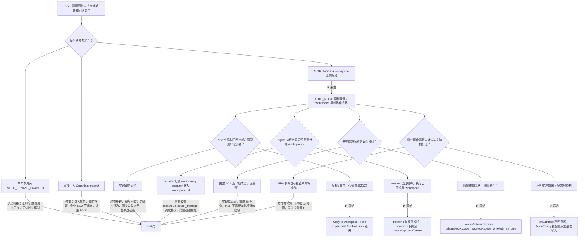

# 团队协作与多租户基础设计决策

## 元数据

| 字段         | 值                                                                 |
| ------------ | ------------------------------------------------------------------ |
| **决策日期** | 2026-04-15                                                         |
| **关联 spec** | `00-workspace-tenancy-foundation-plan.md`、`01-workspace-collaboration-plan.md`、`02-workspace-agent-execution-plan.md` |

---

## 背景

Poco 当前的核心定位是一个 AI 编码助手执行平台：用户创建 task，executor 调用 Claude Agent SDK 在容器中运行，callback 回报进度，前端展示执行过程。整个系统围绕 `user_id` 隔离——每个用户只看到自己的 session、project、preset 和 scheduled task。

但产品目标要求 Poco 同时覆盖两种部署形态：

1. **本地部署**：单用户或小团队，不需要 OAuth，启动即用，关注个人效率
2. **团队部署**：多人围绕共享资源协作，需要成员管理、权限分级、团队看板、资源流转

这意味着系统需要从"多用户隔离"升级为"多租户协作"。但直接引入完整的多租户体系（Organization 层级、部门管理、企业 SSO、域名托管）会严重超出当前团队能力和 MVP 范围。因此核心问题是：**如何在保持当前架构简洁性的同时，引入足够的团队协作能力？**

此外，团队协作还引入了一系列需要收敛的设计问题：资源在个人空间和团队空间之间如何流转？执行链路（session → executor → callback）是否需要感知团队边界？共享资源的权限如何控制？哪些操作需要审计追踪？

---

## 用户叙事：团队协作的核心体验

以下是第一版团队协作预期实现的功能流程，从用户视角描述：

**Alice 是团队 Owner，她创建了一个名为"Poco Core Team"的 shared workspace。**

1. **成员管理**：Alice 在团队设置中生成一个带过期时间的邀请链接，发送给 Bob 和 Carol。Bob 登录后打开链接，选择接受邀请，成为 member。Carol 也通过同样的方式加入。

2. **共享 Preset**：Alice 有一个自己调校好的 preset"Full-Stack Review"，她点击"Copy to workspace"将其复制到团队空间。现在 Bob 和 Carol 都能看到并使用这个 preset。Bob 也创建了一个"Backend Specialist" preset 并设为 workspace 可见。

3. **共享 Project**：团队有一个核心仓库项目。Alice 从自己的个人 project 中"Copy to workspace"将其共享到团队空间。Bob 在团队 project 中可以直接创建 session、执行 agent 任务——session 归 Bob 所有，但引用的是团队 project 资源。Carol 可以把团队 project "Fork to personal"复制到自己的个人空间做实验。

4. **Issue Board**：Alice 创建了一个"Sprint 24"看板，配置了自定义字段"平台"（iOS / Android / Web）。她在看板中创建了一个 issue："修复用户列表分页 bug"，分配给 Bob。Bob 在看板中将 issue 状态从 todo 改为 in_progress，完成后标记为 done。

5. **AI Assignee**：Alice 创建了另一个 issue："为所有 API 端点添加速率限制"，分配给"Backend Specialist" preset，选择"持久化 sandbox"触发模式。系统自动为这个 issue 创建了一个持久化容器，agent 在其中开始工作。Alice 可以在 issue 详情页查看执行进度，也可以向运行中的 agent 发送追加指令。

6. **审计追踪**：团队中所有的关键操作（成员变动、角色变更、资源创建和删除、issue 状态流转、AI 执行触发）都被自动记录。任何成员都可以在团队 Activity 中查看最近的操作历史。

---

## 决策结论

> 系统拆成两个正交维度：`AUTH_MODE` 控制是否需要登录，workspace 能力控制是否启用团队协作。后端域模型统一使用 `workspace`（`kind: personal / shared`），前端文案可以叫"团队"。第一版采用复制/派生而非实时同步，执行链路中 session 仍由用户拥有，不改造 executor 协议。资源权限采用轻量枚举策略而非完整 ACL。审计日志采用声明式装饰器 + 配置层解耦的可插拔架构。

---

## 决策路径



---

## 关键论点

### 为什么 AUTH_MODE 和 workspace 必须正交拆分，而不是一个布尔开关

把"是否需要登录"和"是否有团队协作"混成一个 `MULTI_TENANT_ENABLED` 开关，在两种场景下会出问题：

- 本地部署用户可能不需要 OAuth，但仍然想用 issue board 和 preset 共享——一个布尔开关无法表达这种组合
- 团队部署用户一定需要 OAuth，但可能暂时只用共享 preset 而不创建 shared workspace——同样无法表达

拆成 `AUTH_MODE`（disabled / oauth_required）和 workspace（personal / shared）两个维度后，四种组合自然成立：

| AUTH_MODE | workspace | 典型场景 |
|-----------|-----------|----------|
| disabled | personal only | 本地单用户，启动即用 |
| disabled | personal + shared | 本地小团队，无登录但共享资源 |
| oauth_required | personal only | 云端单用户 |
| oauth_required | personal + shared | 云端团队协作 |

后端统一使用 `workspace` 作为域模型（通过 `kind` 区分 personal / shared），前端文案层可以继续叫"团队"或"Team"。

### 为什么第一版只做复制/派生，不做实时同步

实时双向同步听起来很理想——"个人改了 preset，团队自动更新"，但实际会立刻引入：

- **冲突处理**：Alice 和 Bob 同时修改同一个共享 preset，谁优先？
- **权限回收后的同步行为**：Bob 被移出团队后，他个人空间中 fork 的团队 preset 怎么处理？
- **文件与元数据的同步链路**：project 涉及文件快照、执行上下文、本地挂载，同步哪些、不同步哪些？
- **同步失败恢复**：网络中断、存储不可用时，同步队列如何管理？

复制/派生的语义完全规避了这些问题：操作是单向的、一次性的、结果确定的。`forked_from` 字段保留来源追踪，但 fork 之后源和目标就是两份独立内容。后续如果确实需要同步，可以在复制/派生的基础上逐步增强。

### 为什么 session 保持 user-owned，不让执行层感知 workspace

当前 Poco 的核心执行链路是：

```
用户 → Backend(session) → ExecutorManager(scheduler) → Executor(container) → Callback → Backend
```

如果让 executor 和 executor_manager 感知 `workspace_id`，意味着需要改造：

- executor 的 `TaskRun` schema（新增 workspace_id）
- executor_manager 的调度逻辑（workspace 级并发控制？workspace 级资源隔离？）
- callback 协议（workspace 级事件通知？）

这些改动涉及三个服务的协议变更，范围会迅速膨胀。

更稳妥的做法是：**session 仍然由发起用户创建和拥有**，只是在创建 session 时引用 workspace 范围内有权限的 project。workspace 相关的权限校验全部留在 backend API 层，执行层只看到它已经能理解的 session、project、preset 和 prompt。

### 为什么选择轻量枚举策略而非完整 ACL

完整 ACL 的典型实现是：一张 `resource_permissions` 表，每行记录"哪个用户对哪个资源有什么权限"。这在小团队场景下有两个问题：

- **实现成本**：每个 API 请求都需要查询权限表，service 层的每个方法都要加权限检查
- **前端复杂度**：需要给用户提供"逐成员设置权限"的 UI，交互设计成本高

轻量枚举策略把权限简化为四个级别：`private`、`workspace_read`、`workspace_write`、`admins_only`。权限判断变成一个简单的枚举比较，service 层逻辑清晰，前端 UI 也只需一个下拉选择。

第一版用团队级角色（owner / admin / member）+ 资源级枚举策略两层组合，已经能覆盖大部分场景。如果后续确实需要更细粒度的控制，可以在枚举策略的基础上逐步扩展。

### 为什么审计日志采用声明式装饰器 + 配置层，而不是 ORM 事件自动拦截

ORM 事件自动拦截（如 SQLAlchemy `after_insert`、`after_update`）看似最省事——所有写操作自动记录，不用改业务代码。但它有三个致命问题：

1. **粒度不可控**：每次 `db.flush()` 都会触发，包括用户更新自己的头像这种不需要审计的操作
2. **上下文丢失**：ORM 事件中很难获取"谁触发了这次操作"（current_user 通常在 request context 中，不在 ORM session 中）
3. **无法按需开关**：如果某个操作不需要记录，必须修改 ORM event listener，侵入性很强

声明式装饰器 + 配置层的设计把这三个问题都解决了：

- `@auditable(action="workspace.member_role_changed")` 明确表达"这个方法会产生审计日志"，粒度由开发者控制
- 装饰器在 service 方法层执行，可以访问 `current_user_id` 等请求上下文
- `AuditConfig` 支持通配符配置（如 `"issue.*": true`，`"issue.invite_accepted": false`），新增或关闭审计点只需改配置

---

## 约束与前提

- 第一版不覆盖实时双向同步、细粒度逐成员 ACL、企业级组织层级、域名托管
- 第一版不改造 executor/executor_manager 调度协议
- 团队 project 第一版不直接绑定用户本地文件系统挂载
- 审计日志第一阶段只做后端数据记录和 API，不做 UI
- 审计日志写入采用 fire-and-forget，不阻塞主事务

---

## 历史变更

| 日期       | 变更内容 | 原因               |
| ---------- | -------- | ------------------ |
| 2026-04-15 | 初次记录 | 调研后达成设计共识 |
