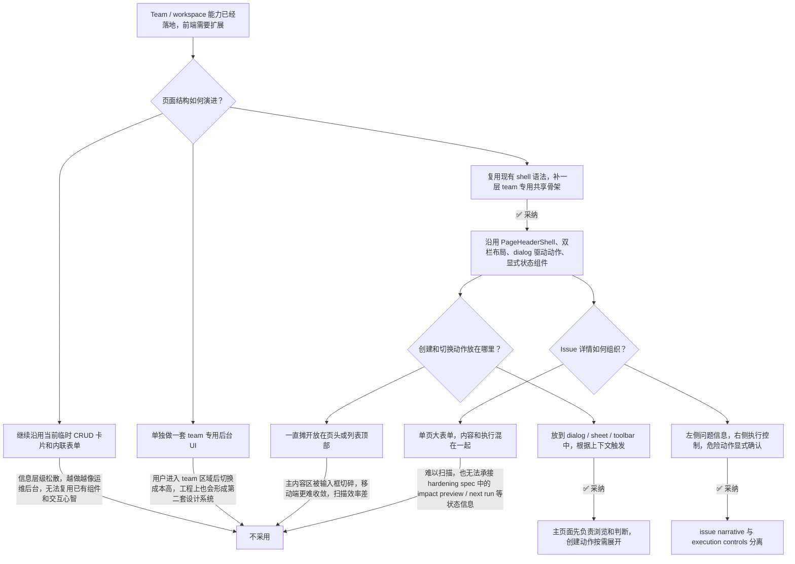

# 团队协作前端 UI 对齐约束

## 元数据

下面先记录这份决策的时间和关联范围，方便后续在 workspace 相关 spec 之间交叉引用。

| 字段 | 值 |
| --- | --- |
| **决策日期** | 2026-04-16 |
| **关联 spec** | `00-workspace-tenancy-foundation-plan.md`、`01-workspace-collaboration-plan.md`、`02-workspace-agent-execution-plan.md`、`03-workspace-agent-execution-hardening-plan.md`、`04-workspace-team-ui-refresh-plan.md` |

---

## 背景

Poco 的 workspace / team 能力已经完成第一轮产品和数据建模：workspace、member、invite、board、issue、AI assignee、persistent sandbox、scheduled task 这些核心概念都已经在 constitution 和 draft spec 中被明确下来，最近的前端提交也把 team overview、members、invites、issues 路由接进了现有 shell。

但当前 team 相关前端仍明显落后于仓库里已经成熟的页面语法。`frontend/features/capabilities/components/capabilities-page-client.tsx`、`frontend/features/projects/components/project-page-client.tsx`、`frontend/features/scheduled-tasks/components/scheduled-tasks-page-client.tsx` 这些页面已经形成了稳定模式：统一页头、克制的卡片层级、明确的主次栏位、对话式创建编辑，以及显式的 loading / empty / refresh 状态。相比之下，当前 `frontend/features/workspaces/ui/team-pages.tsx` 和 `frontend/features/issues/ui/issues-pages.tsx` 更像把 API 操作直接铺到页面上，信息层级、操作落点和导航结构都比较松散。

这会带来两个问题。第一，用户进入 team 区域后，会突然离开 Poco 既有的交互节奏，像是在用另一套后台。第二，后续 agent 如果继续在没有约束的前提下扩展 workspace / issue UI，就会不断复制这种“功能先塞进去”的页面结构，越修越散。

因此，这里需要一份项目级前端 UI 决策记录，明确 team / workspace / issue 页面应该继承什么、禁止什么，以及后续 agent 在实现时可以直接参考哪些仓库内示例。

## 用户叙事

这份约束希望收敛出的，不是“更好看一点”的页面，而是一条和现有 Poco 体验连续的团队协作路径。

**Alice 是团队 owner，她进入 Team 页面时，首先看到的是一个稳定的 team shell。**

1. **进入团队上下文**：页头延续 Poco 现有的 `PageHeaderShell` 结构，左侧只负责标题、当前 workspace 和简短说明，右侧只放当前页动作。Alice 不需要在页头里阅读一排输入框和选择器，就能知道自己当前在哪个 team 空间。
2. **在团队各页切换**：overview、members、invites、issues 共用一套二级导航和同一套内容容器。Alice 从成员页切到 issue board 时，不会感觉像跳到了另一个应用。
3. **完成创建动作**：创建 workspace、invite、board、issue 这些动作通过 dialog、sheet 或 drawer 完成。Alice 在浏览列表时，主内容区优先展示已有数据，而不是被常驻输入框切碎。
4. **浏览 issue 并进入详情**：issue 页面先让 Alice 扫描 board 和 issue 列表，再进入详情。详情页把 issue 内容、相关 project、AI assignee、execution 状态拆成清晰区域，而不是一整页混合表单。
5. **处理高风险操作**：当 Alice 切换 AI assignee、取消执行或释放 container 时，界面能提供足够的上下文和确认信息。这和 `03-workspace-agent-execution-hardening-plan.md` 中定义的 impact preview 语义保持一致。

## 决策结论

这次决策的核心不是增加视觉要求，而是明确 team 区域必须服从现有产品骨架，不再接受平铺式 CRUD 页面继续扩张。

> Workspace / team / issue 前端必须继承 Poco 现有 shell 型 UI 语言：稳定页头、共享二级导航、清晰的 index/detail 结构、对话式创建编辑、显式状态组件，以及基于 design token 的中性卡片体系。禁止继续在 team 页面中堆叠临时 CRUD 表单、单页混合信息层级，或发明独立于现有产品的“第二套后台 UI”。

## 决策路径

下图总结了这次 UI 决策的推理路径，重点是为什么不继续沿用当前的临时页面结构。



## 关键论点

下面几条论点解释的是“为什么必须这样做”，而不只是“推荐这样做”。

### 为什么 team / workspace 页面必须继承现有 shell 语法

Poco 已经有一套可识别的页面骨架：`PageHeaderShell` 负责页头，内容区普遍使用 `p-4 sm:p-6` 或 `px-6 py-6` 的外边距，桌面端在“导航 / 列表 / 详情”之间使用固定栏宽或 `minmax(0, 1fr)` 的 grid。`frontend/features/capabilities/components/capabilities-page-client.tsx` 和 `frontend/features/projects/components/project-page-client.tsx` 已经把这种语法跑通了。

Team 前端如果继续自由发挥，就会把用户从熟悉的页面节奏中踢出去。更实际的问题是，后续 agent 也不会知道该复用哪些模式，只会继续在 `team-pages.tsx` 和 `issues-pages.tsx` 里追加新的卡片和按钮。把“必须复用现有 shell 语法”提升为 constitution，实际上是在给后续所有实现工作设边界。

### 为什么创建、切换和高风险动作不能长期以内联表单常驻页面

当前 `frontend/features/workspaces/ui/team-pages.tsx` 的 header 右侧同时放了 workspace 切换、创建输入框和创建按钮；`frontend/features/issues/ui/issues-pages.tsx` 又在 board 卡和 issue 卡顶部各自塞了一排创建输入。这样的页面在数据很少时还能工作，但一旦团队数量、board 数量或 issue 数量增长，浏览和创建会相互争抢注意力。

Poco 现有更成熟的做法，是让主页面先承担“浏览、理解、选择上下文”的责任，再通过 dialog 或 drawer 进入创建流。`frontend/features/scheduled-tasks/components/scheduled-tasks-page-client.tsx` 已经是现成例子：页面本体先展示表格和工具栏，新增和编辑都通过独立 dialog 完成。这种模式更适合团队协作页，也更容易在移动端收拢。

### 为什么 issue 页面必须采用 index / detail 结构

Issue board 的关键任务不是“编辑一条记录”，而是“先找到正确的 board 和 issue，再决定要不要进入详情和执行动作”。因此，team issues 页面必须优先优化扫描路径，而不是优先优化表单堆叠。

`frontend/features/capabilities/components/capabilities-page-client.tsx` 已经说明了这件事：桌面端的左栏负责选择视图，右侧负责内容；移动端则先呈现列表，再进入 detail。issue board 也应该遵循相同原则。当前 `frontend/features/issues/ui/issues-pages.tsx` 把“创建 board”“创建 issue”“浏览 issue”压进两个普通 `Card` 里，导致 board 语义、issue 语义和动作优先级被抹平。后续如果还要接 `03-workspace-agent-execution-hardening-plan.md` 里的 assignee 切换确认、next run、retained container 信息，这种平铺结构会更难扩展。

### 为什么状态组件和语义色不能各写各的

Team / issue 场景里的状态很多：workspace role、invite 是否失效、issue status、assignment status、session status、container 是否存在。继续把这些状态直接渲染成裸文本，会让页面看上去像调试面板，而不是产品界面。

仓库里已经有一组足够用的原子：`Badge`、`Empty`、`Skeleton`、`Button`、`Card`。`frontend/components/ui/empty.tsx` 已经把空态结构统一好了，`frontend/components/shared/page-header-shell.tsx` 已经把页头统一好了，`frontend/components/ui/card.tsx` 和 `badge.tsx` 负责表意层级。Team 前端优先用这套组件组织状态，而不是继续用“边框盒子 + 一行文本”临时表达。

## UI 约束清单（含仓库示例）

下面这组约束是给后续 agent 直接执行用的。每一条都对应已有仓库模式，避免写成抽象审美建议。

### 1. 页面骨架约束

所有 workspace / team / issue 路由都必须共享同一套页头和内容容器。优先复用 `PageHeaderShell`，并保持 `main` 容器的宽度、内边距和 section gap 与现有页面一致。

- 页头左侧只放标题、subtitle 和当前上下文，不放长表单。
- 页头右侧只放当前页动作，例如 refresh、new invite、new issue、open settings。
- 桌面端主内容区优先使用 `max-w-6xl` 或与现有页面一致的 grid，而不是无限宽卡片流。

参考示例：

```tsx
<PageHeaderShell
  left={
    <div className="min-w-0">
      <p className="text-base font-semibold leading-tight">...</p>
      <p className="text-xs text-muted-foreground">...</p>
    </div>
  }
  right={<Button variant="outline" size="sm">...</Button>}
/>
```

对应仓库实现：

- `frontend/features/capabilities/components/capabilities-library-header.tsx`
- `frontend/features/home/components/home-header.tsx`
- `frontend/features/projects/components/project-header.tsx`

明确禁止的反例：

- 在 team header 中长期常驻“workspace 选择器 + 新建输入框 + 提交按钮”的三连结构
- 在没有统一内容容器的情况下，让 overview、members、invites、issues 各自长成不同页面风格

### 2. 导航层级约束

Team 区域必须有稳定的二级导航，并且 issues 不能脱离 team shell 单独长成一页。页面切换时，用户应该持续感知“我仍在同一个 workspace 协作区域内”。

- overview、members、invites、issues 共享同一套 section nav 组件和选中态规则。
- 如果 issues 内部存在 board 选择，它是 team 二级导航下的三级导航，不应取代 team 本身的导航。
- 移动端优先沿用现有“列表先行，详情后入”的模式。

参考示例：

```tsx
<div className="hidden min-h-0 flex-1 md:grid md:grid-cols-[240px_minmax(0,1fr)]">
  <SidebarLikeNav />
  <main className="min-h-0 overflow-hidden">...</main>
</div>
```

对应仓库实现：

- `frontend/features/capabilities/components/capabilities-page-client.tsx`
- `frontend/features/projects/components/project-page-client.tsx`

### 3. 创建与编辑交互约束

浏览页优先服务于扫描和判断，创建与编辑通过 dialog、sheet、drawer 或独立 detail panel 进入。只有轻量筛选条件可以内联放在工具栏里。

- 新建 workspace、invite、board、issue 使用 dialog 或 sheet。
- assignee 切换、trigger mode 修改、schedule 修改这类会影响执行状态的编辑动作，不放在默认浏览流的首屏。
- 列表页顶部可以有 toolbar，但不应被多个独立输入框占满。

参考示例：

```tsx
<ScheduledTasksHeader onAddClick={() => setCreateOpen(true)} />
<CreateScheduledTaskDialog open={createOpen} onOpenChange={setCreateOpen} />
```

对应仓库实现：

- `frontend/features/scheduled-tasks/components/scheduled-tasks-page-client.tsx`

### 4. index / detail 结构约束

Issue 相关页面必须明确区分“找东西”和“改东西”。列表页面先解决 board 选择、issue 扫描和筛选；详情页面再承接描述、关联资源、AI assignee 和 execution 控制。

- issues index 至少要分出 board rail / board summary / issue list 三层。
- issue detail 至少要分出 problem summary 区和 execution controls 区。
- session、container、next run、impact preview 这类执行状态信息必须有独立区域，不和 description、prompt 编辑区混在一个长表单里。

参考示例：

```tsx
<div className="mx-auto grid max-w-6xl gap-5 lg:grid-cols-[minmax(0,1fr)_360px]">
  <IssueSummaryColumn />
  <ExecutionSidebar />
</div>
```

对应仓库实现可借鉴的分栏思路：

- `frontend/features/projects/components/project-page-client.tsx`
- `frontend/features/scheduled-tasks/components/scheduled-task-detail-page-client.tsx`

### 5. 状态、空态和反馈约束

Team / issue 页面必须对 loading、empty、refreshing、error、destructive action 给出统一表达，不能只在控制台报错或用一行灰字兜底。

- loading 优先用 `Skeleton`，形状尽量接近最终布局。
- empty 优先用 `components/ui/empty.tsx` 的组合组件。
- destructive 或 execution 相关操作要么有显式确认，要么在按钮文本和辅助说明中写清影响。
- 状态标签优先用 `Badge`，不要直接裸写枚举值。

对应仓库实现：

- `frontend/components/ui/empty.tsx`
- `frontend/features/workspaces/ui/team-pages.tsx` 中已有的 `Skeleton` 使用方式可以保留，但需要升级成与最终布局匹配的骨架
- `frontend/features/scheduled-tasks/components/scheduled-task-detail-page-client.tsx` 的 refresh / trigger / delete 操作分组

### 6. 视觉 token 和文案约束

Team 前端不单独发明颜色体系。所有颜色、阴影、边框半径和排版都必须沿用 `frontend/app/globals.css` 中的 design token，并使用 i18n 文案。

- 不写裸色值，不绕过 `bg-card`、`border-border/60`、`text-muted-foreground` 这些现有 token。
- 用户可见文案全部走翻译文件，不在 team 组件中硬编码。
- 只在真正需要强调时使用 icon chip、badge 或主按钮，避免每个卡片都像 hero。

可直接参考的视觉节奏：

- `frontend/features/home/components/home-bottom-card-deck.tsx`
- `frontend/components/ui/feature-card.tsx`
- `frontend/components/shell/sidebar/sidebar-card-styles.ts`

## 约束与前提

这份决策成立时，默认以下产品和工程前提保持不变；如果这些前提变化，相关 UI 约束也需要重新评估。

- 第一版 team UI 仍然运行在现有 App Shell 内，不单独建设独立 team 子应用。
- 优先复用现有组件和布局模式，只有在现有原子无法满足时才新增 shared component。
- issue detail 的结构必须为 `03-workspace-agent-execution-hardening-plan.md` 预留 impact preview、next run、retained container 说明等信息位。
- 移动端必须保持可用，不能只优化桌面端的双栏布局。
- 这份约束解决的是结构和一致性问题，不要求把 team 页做成独立视觉主题。

## 历史变更

这里记录这份 UI 决策的演进，避免后续再次回到“为什么当时这样定”的讨论里。

| 日期 | 变更内容 | 原因 |
| --- | --- | --- |
| 2026-04-16 | 初次记录 | team / workspace 前端初版落地后，需要统一 UI 对齐基准，避免后续实现继续发散 |
