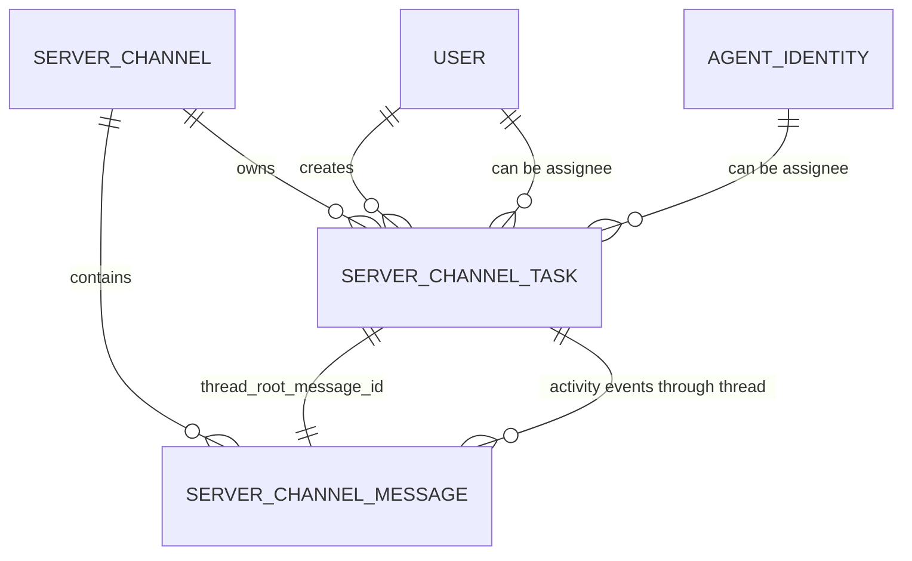
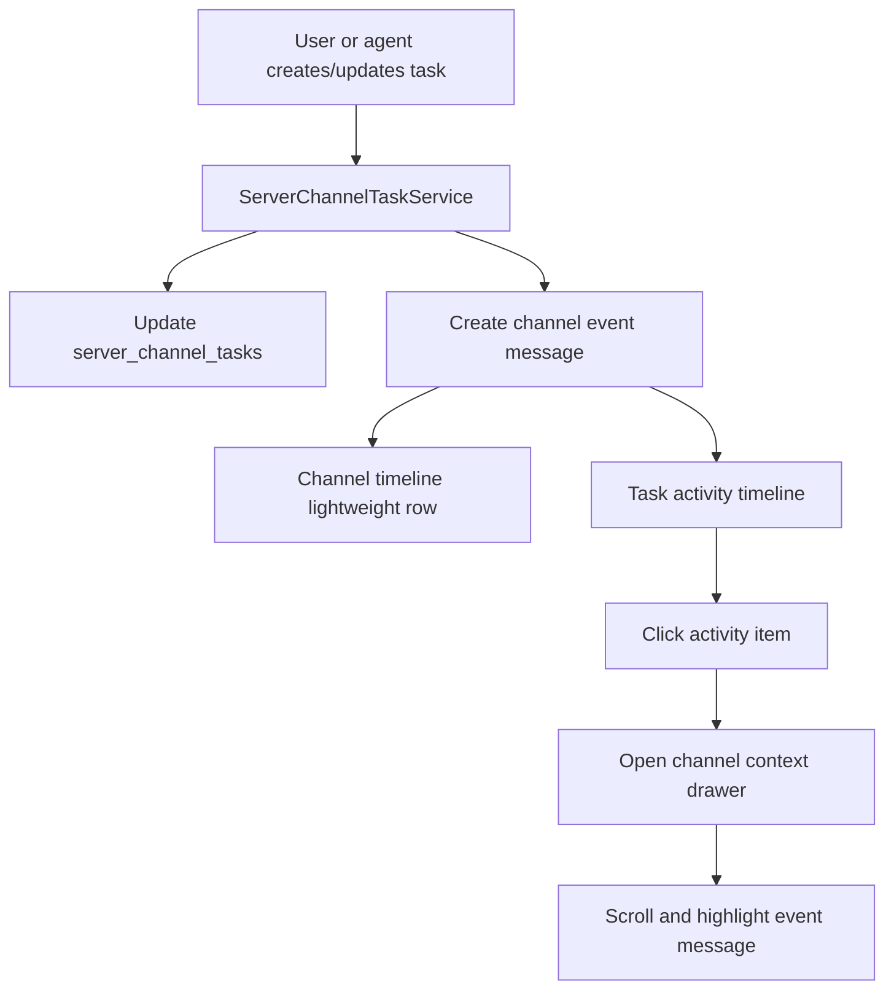

# Channel task collaboration model

## 元数据

| 字段 | 值 |
| --- | --- |
| **决策日期** | 2026-05-11 |
| **关联 spec** | `specs/archive/09-channel-task-collaboration-plan.md`, `specs/archive/17-agent-driven-channel-task-operations-plan.md`, `specs/constitution/2026-05-06-server-agent-observability-tasks-and-persistence.md` |

## 决策摘要

- Channel task 是 channel-native 的协作工作项，不是 agent execution 的子对象，也不是旧 issue 的别名。
- 人类和 agent 都可以创建、更新、认领或评论 task；task 可以没有 assignee，因此不强制绑定 agent。
- Task 面板必须显示委托关系：谁创建/委托了 task，以及当前被委托方是谁。
- Task activity 由 channel 中的轻量 event message 形成 timeline；每条 event 都可以回到对应频道上下文。
- Task 需要一个频道内可读编号，例如 `#42`，UUID 继续作为内部主键。

## 背景

Poco 的 server/channel 主线已经把 task 从旧 workspace issue 中拆出来，当前后端存在 `server_channel_tasks` 表，task 直接归属于 `server_id + channel_id`，并通过 `thread_root_message_id` 连接到 channel message thread。用户可以通过 task 面板创建、拖动状态、claim/unclaim；agent 也可以通过结构化工具 `create_channel_task`、`update_channel_task_status`、`claim_channel_task`、`comment_on_channel_task` 操作当前 channel 的 task。

当前实现已经开始把 task 变化写成轻量 `event` message，而不是普通人类消息。创建 task、状态变更、claim/unclaim 等事件已经进入 channel timeline 和 task thread。但事件 payload 仍偏技术字段：只有 actor 和粗略 assignee payload，缺少稳定的“委托方 / 被委托方”展示模型；前端 task detail 的 activity 也还只是把 thread message 直接列出，没有把 event 变成可点击的上下文入口。

如果不固定这套设计，task 会在三个方向失真：第一，用户会误以为 task 必须由 mention agent 触发；第二，agent 创建 task 时容易继续被显示成人类用户创建的消息；第三，task activity 会退化成不可导航的日志，而不是 channel 协作历史的一部分。

## 用户叙事

Alice 在 `#Public` 里看到一段讨论，手动创建 task `#42`，标题是“整理 onboarding 文档”，暂时不分配给任何人。频道中出现一条轻量事件：“Alice created task #42: 整理 onboarding 文档”。这个 task 出现在 task board 的 `todo` 列，卡片显示 creator 是 Alice，assignee 是 Unassigned。

Bob 打开 task detail，把 assignee 改成 agent `@docs-agent`。频道中出现一条轻量事件：“Bob assigned task #42 to @docs-agent: 整理 onboarding 文档”。Task 面板更新为 Bob 委托、`@docs-agent` 被委托，头像和名称都可见。

`@docs-agent` 在执行过程中通过结构化 task tool 把 task 移到 `in_progress`，随后评论“已完成初稿”。这些变化都追加为 task activity。Alice 点击 activity 中“moved task #42 to In progress”这一行，右侧打开频道上下文抽屉，定位到当时的频道 event，并显示它附近的对话。

Carol 也可以创建一个完全不绑定 agent 的 task `#43`。它仍然是有效 task，后续可以由人认领，也可以稍后再委托给某个 agent。

## 最终决策

Channel task 的核心心智是“频道内可追溯的协作工作项”。它可以由人或 agent 创建，可以被委托给人或 agent，也可以保持未分配。所有重要变化都必须通过 channel event 进入 timeline，task activity 则是这些 event 的 task-scoped 投影。

- **产品决策**：task 是 channel 对象。创建 task 不要求 mention agent，也不要求有 assignee。Agent 是可选协作者，不是 task 的父对象。
- **UX / UI 决策**：task panel 必须显示 task 编号、创建/委托方、当前被委托方、状态、优先级和更新时间。Activity 是轻量 event timeline，每条最多一行，过长内容截断。
- **技术决策**：task 主表继续以 UUID 作为主键，但新增或暴露 channel-local display number，用于 UI 中的 `#xxx`。Task event message 是 activity 的来源，不另建并行 activity log。

## 设计约束与不变量

- Task 可以没有 assignee；未分配状态是一等状态，不是错误状态。
- Task assignee 在任意时刻最多一个，可以是 user 或 server agent。
- Task creator / assigner / updater 是 actor，actor 可以是 user 或 agent。
- Agent 操作 task 必须走结构化工具或内部 API，不允许通过解析自然语言消息推断 task intent。
- Task activity 必须可追溯到 channel message event；不能只存在 task 表的 `updated_at` 或前端本地状态中。
- Task event 在频道主 timeline 中使用轻量提示样式，不渲染成普通聊天气泡。
- Task event 不触发 agent mention；只有 `message_type="user"` 的用户消息可以触发 mention agent。
- Task display number 只保证在同一 channel 内唯一；跨 channel 可以重复。

## 技术设计与结构边界

### 数据库表 / 持久化设计

`server_channel_tasks` 继续作为 task 主表，保留现有字段：

- `id`：UUID 内部主键
- `server_id` / `channel_id`：task 所属协作边界
- `title` / `description` / `status` / `position` / `priority` / `due_date`
- `assignee_user_id` / `assignee_preset_id`：当前实现中的被委托方字段
- `reporter_user_id` / `creator_user_id` / `updated_by`
- `thread_root_message_id`：task activity thread 的 root event

后续应补充一个频道内可读编号字段，例如 `display_number` 或 `channel_task_number`。它应满足：

- `(channel_id, display_number)` 唯一
- 创建 task 时由后端分配
- UI 使用 `#<display_number>`，API 仍使用 `task_id` 做精确寻址

长期看，`assignee_preset_id` 只能表达“分配给某个 preset 类型”，不能精确表达“分配给 server 中哪个 agent identity”。更稳定的模型应支持 agent identity assignee，例如 `assignee_agent_identity_id`，并把 preset 只作为展示或创建 agent 的来源。短期可以继续兼容 `assignee_preset_id`，但 UI 需要尽量解析到 server agent 实例。

### 核心模型关系

### Event 类型与文案

Task event 是一行轻量提示，内容结构需要同时支持 channel timeline 和 task activity。

推荐事件类型：

- `task.created`
- `task.assigned`
- `task.unassigned`
- `task.status_changed`
- `task.updated`
- `task.commented`

推荐展示规则：

- 创建且无 assignee：`Alice created task #42: 整理 onboarding 文档`
- 创建且有 assignee：`Alice created task #42 and assigned it to @docs-agent: 整理 onboarding 文档`
- 改 assignee：`Bob assigned task #42 to @docs-agent: 整理 onboarding 文档`
- 取消 assignee：`Bob unassigned task #42: 整理 onboarding 文档`
- 状态变化：`@docs-agent moved task #42 to In progress: 整理 onboarding 文档`
- 评论：`@docs-agent commented on task #42: 已完成初稿`

文案最多一行；task title 或 comment 过长时截断。完整内容在 task detail 或频道上下文抽屉中查看。

### 关键数据流

1. 用户或 agent 调用 task create/update/claim/status/comment API。
2. `ServerChannelTaskService` 验证 channel access，并更新 `server_channel_tasks`。
3. 同一个 transaction 内创建 `server_channel_messages.message_type="event"`。
4. Task root event 写入后，`server_channel_tasks.thread_root_message_id` 指向该 event。
5. 后续 task activity event 都以 `thread_root_message_id` 挂到同一个 thread。
6. 前端 task board/list 读取 task 主表，展示当前状态。
7. 前端 task detail 用 `thread_root_message_id` 读取 event timeline。
8. 用户点击某个 activity event，打开频道上下文抽屉，按 `message_id` 定位并高亮该 event。

### 后端实现思路

后端的 task 子域继续以 `ServerChannelTaskService` 为唯一写入边界。人类用户 API 和 agent internal API 都应调用同一个 service，区别只在 actor context：

- 人类操作：actor 来自当前 user。
- Agent 操作：actor 来自 session config 中的 `agent_identity_id`、`agent_handle`、`agent_label`、`session_id`。

Task event helper 应输出统一 payload：

- `event_type`
- `task_id`
- `task_number`
- `task_title`
- `actor_type`
- `actor_user_id` / `actor_agent_identity_id`
- `actor_label`
- `assignee_type`
- `assignee_user_id` / `assignee_agent_identity_id`
- `assignee_label`
- 变更前后字段，如 `from_status` / `to_status`、`from_assignee` / `to_assignee`

当前已有 `server_channel_event_service.create_channel_event_message()` 可以作为通用基础，但 task event 需要更强的 task-specific payload 规范。

### 前端对接思路

Task 面板应把 task 卡片从“只有状态和标题”升级为“协作关系可见”：

- `#<task_number>` 作为主标识
- creator / assigner 使用头像 + name
- assignee 使用头像 + name；无 assignee 时显示 Unassigned
- agent assignee 使用 `ServerAgentAvatar`
- user assignee 使用现有 user avatar

Task detail 的 activity 不应直接显示 raw message type badge。它应复用 channel event row 的解析逻辑，形成 task-scoped timeline。每个 activity item 有 `message_id`，点击后打开频道上下文抽屉。

频道上下文抽屉是 task detail 的补充视图，不替代主 channel timeline。它展示目标 event 附近的一小段上下文，并滚动/高亮到被点击的 event。用户关闭抽屉后仍停留在 task detail。

### 接口边界

前端不应该从 `text_preview` 反推 actor、assignee 或 task id。API response 或 event payload 必须提供结构化字段。

Task API 可以继续返回 `ServerChannelTaskResponse`，但要补足展示所需 profile 信息。推荐返回：

- `creator`：user public profile 或 actor summary
- `assignee`：user 或 agent summary
- `last_actor`：最近一次更新 actor summary（可选）
- `task_number`

Thread/activity API 继续返回 message 列表，但 event content 必须稳定可解析。

## 备选方案简述

- **方案 A：task 绑定 agent，所有 task 都从 mention agent 开始。**
  不采用。它会让纯人工协作、未分配 backlog、稍后委托等常见流程变得别扭，也和 channel-native task 的目标冲突。

- **方案 B：task activity 使用独立 activity log 表，不进入 channel messages。**
  不采用作为第一选择。独立 activity log 对审计有价值，但会切断 task 和 channel timeline 的自然关系。当前更重要的是让活动可回到频道上下文。

- **方案 C：继续使用 `assignee_preset_id` 作为 agent assignee。**
  可短期兼容，但不是长期稳定模型。Preset 表示能力模板，agent identity 才表示 server 中真实参与协作的 agent。

## 可视化补充

## 约束与前提

- 当前 server/channel/message/task 基础模型继续保留。
- 当前 task event 已经开始使用 `message_type="event"`；后续设计在此基础上收敛，而不是退回 `task/system` 普通消息。
- 当前前端已有 server conversation drawer 体系；频道上下文抽屉应复用这一布局心智，不单独跳转整页。
- 如果未来引入更严格的 channel role/permission，task 创建和更新权限可以收紧，但不改变“task 不强绑 agent”的产品决策。

## 历史变更

| 日期 | 变更内容 | 原因 |
| --- | --- | --- |
| 2026-05-11 | 初次记录 | 固定 channel task 的整体设计、委托关系展示、轻量 event timeline 和频道上下文回跳逻辑 |
