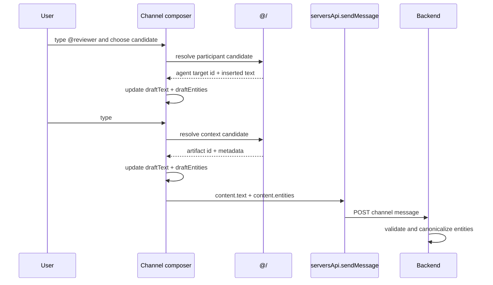
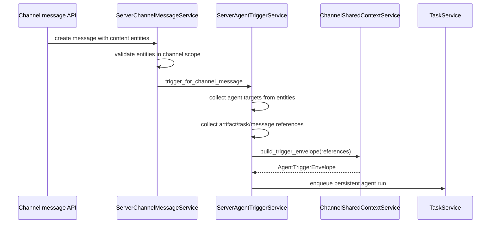

# 频道结构化 Mention 与上下文引用决策

## 元数据

| 字段 | 值 |
| --- | --- |
| **决策日期** | 2026-05-25 |
| **关联 spec** | `specs/research/2026-05-25-structured-mention-and-channel-context-research.md`、`30-structured-channel-mentions-and-context-references-plan.md` |
| **关联决策** | `2026-05-05-channel-shared-context-and-artifacts.md`、`2026-05-08-persistent-agent-message-passing-and-tool-injection.md`、`2026-05-11-channel-task-collaboration-model.md` |

## 决策摘要

当前频道聊天中的 `@token` 同时承担 agent 触发、人类提及和普通文本高亮。随着频道共享文件上传能力加入，用户还需要在聊天中引用文件；继续依赖文本扫描会无法区分“触发一个 agent”和“引用一个 artifact”。

最终决定：频道输入采用 `@` 与 `#` 分工。`@` 只用于人类用户和 agent 等参与者；`#` 用于文件、task、thread 等频道上下文对象。无论 UI 使用哪个前缀，发送协议都必须把选择结果落为结构化 `content.entities`，后端以 entity 为事实源执行路由、通知和引用传播。

这次决策主要影响频道输入框、消息发送协议、agent 触发链路、共享 artifact 引用、消息渲染、hover card 以及 trigger envelope 中的 `references`。

## 背景

Poco 已经具备 server channel、persistent agent、thread、task、channel artifacts 和 agent-facing channel runtime tools。人类可以在频道中 `@agent` 触发持久化 agent，agent 被触发后可以通过 `list_channel_artifacts`、`search_channel_artifacts`、`read_channel_artifact` 等工具读取频道共享文件。

当前缺口在于用户消息本身仍然是纯文本协议。前端通过正则发现正在输入的 `@token`，只把 `@handle` 或 `@label` 插入 textarea；后端再通过另一个正则扫描 `@handle`，与频道内 active agent membership 匹配后触发 agent；渲染层则把任意 `@token` 高亮。这个链路能支持最早的 agent mention，但已经无法支撑文件引用和后续更多频道对象。

频道共享文件上传后，用户自然会说“让 `@reviewer` 看一下 `#design.md`”。这句话里 `@reviewer` 是执行者路由，`#design.md` 是上下文引用。二者的产品语义、权限校验、副作用和运行时传递方式都不同。如果继续只扫描文本，系统无法知道用户到底选择了哪个文件，也无法把该文件稳定写入 `AgentTriggerEnvelope.references.artifact_ids`。

如果不做这次决策，后续会出现一组持续扩大的问题：文件名和 agent handle 冲突、普通 `@token` 意外触发 agent、历史消息因 display name / handle 变化失去语义、hover card 无法可靠展示对象信息、未来 task/thread/tool 入口只能继续堆叠脆弱 regex。

## 用户叙事

**Alice 在 `#frontend` 频道中让 agent 查看文件。**

1. Alice 输入 `@`，候选菜单只展示人类用户和频道 agent。
2. Alice 选择 `@reviewer`，输入框插入可读 token，同时草稿中生成 `kind="agent", action="trigger"` 的 entity。
3. Alice 输入 `#`，候选菜单展示当前频道可引用的共享文件、task 和 thread。
4. Alice 选择 `design.md`，输入框插入 `#design.md`，草稿中生成 `kind="artifact", action="reference"` 的 entity。
5. Alice 发送消息：“`@reviewer 看一下 #design.md 的交互风险`”。
6. 后端只根据 agent entity 触发 `@reviewer`，并把 artifact entity 写入 trigger envelope 的 `references.artifact_ids`。
7. `@reviewer` 在运行时看到被引用的 artifact id，可以按需调用 channel artifact tool 读取文件内容。

**Bob 在同一频道中提到一个同事。**

1. Bob 输入 `@alice`，这是 human mention。
2. 该 entity 的 action 是 `mention`，用于渲染、hover profile 和未来通知，不触发 agent。
3. 如果文本里还出现了普通字符串 `@draft-name`，但 Bob 没有从候选项中选择 entity，后端不会把它当成触发或通知。

**Carol 回看历史消息。**

1. Carol hover 到 `@reviewer`，看到 agent 名称、handle、描述、加入时间和当前状态；点击仍进入 agent 详情。
2. Carol hover 到 `#design.md`，看到文件名、逻辑路径、mime type、大小、上传者和上传时间；点击打开文件预览或下载。
3. 如果某个引用对象已删除或 Carol 没有权限，消息仍显示发送时的 fallback 文本，但交互弱化并显示不可用状态。

## 最终决策

频道 mention 与上下文引用采用“前缀分工 + 结构化 entity 协议 + entity-first 后端路由”的模型。

- **产品决策**：
  - `@` 只代表频道参与者：human user、server agent、未来可能的 chat participant。
  - `#` 代表频道上下文对象：artifact/file、task、thread、message 等可被引用对象。
  - `/` 预留给命令或显式操作入口，不与 `@` / `#` 混用。
  - agent trigger、human mention、artifact reference、task reference 是不同动作，不能再统一解释为“文本里有一个 @”。
  - 频道 direct message 继续由 direct channel 的目标决定，不依赖正文里是否存在 `@agent`。
- **UX / UI 决策**：
  - 输入 `@` 时，候选菜单只展示参与者，并按 agent / human 分组。
  - 输入 `#` 时，候选菜单展示可引用上下文，并按 files / tasks / threads 分组。
  - 选择候选项后，输入框可以继续显示普通文本 token；但草稿必须同步维护结构化 entity。
  - 消息渲染优先基于 entities 生成 mention/reference chip 和 hover card；旧消息才使用 regex 高亮 fallback。
  - hover 到 agent/user/avatar/mention 时展示轻量资料卡；点击保留当前详情跳转或资料入口。
- **技术决策**：
  - `server_channel_messages.content.entities` 成为 message mention/reference 的第一阶段持久化协议。
  - `content.text` 只负责人类可读正文；`content.entities` 负责机器可执行语义。
  - 后端保存前必须校验并 canonicalize entities，不能信任前端传入的 target 信息。
  - agent 触发链路必须 entity-first。只有当旧消息没有 entities 时，才允许走 `@handle` regex 兼容。
  - artifact/task/message references 必须进入 `AgentTriggerEnvelope.references`，供 executor 和 channel runtime tools 使用。

## 设计约束与不变量

- 新消息的 agent 触发不得再只依赖自由文本 regex。
- 只要 `content.entities` 存在，后端不得额外扫描文本中的 `@token` 来触发更多 agent。
- `@` 的候选范围必须限于参与者；文件、task、thread 不能继续混入 `@` picker。
- `#` 选择的对象是引用，不是执行者；引用 artifact/task/thread 本身不得触发 agent。
- Entity 的 `target_id` 是事实源；display text、handle、logical path 只作为展示和 fallback。
- Entity 中的 id 传递必须被理解为 trigger envelope 的上游输入，而不是单纯的前端渲染状态。
- 后端必须按当前 server/channel scope 校验 agent、user、artifact、task、thread 是否可见或可引用。
- 旧消息无 entities 时可以保留 regex 兼容；兼容路径不能成为新实现的主协议。
- Agent 输出中的 `@handle` 不自动触发另一个 agent。agent-to-agent 协作仍必须通过显式 collaboration tool。
- `published artifacts` 继续是频道共享文件的稳定边界；`logical_path` 不等于容器本地路径。
- Artifact reference 必须通过 artifact id 传播到 trigger envelope，agent 读取内容时仍使用 channel runtime artifact tools。
- `read_channel_artifact` 的主读取参数是 `artifact_id`；`logical_path` 只能使用 artifact tools 返回的完整 `logical_path`，不能使用 display name、文件 basename 或正文里的 `#token`。
- Channel runtime façade 必须透传 backend 的业务错误语义。未找到 artifact、参数非法、权限不足等错误不能被中间层统一包装成 500，否则 agent 会误判为服务故障而不是调用参数问题。
- 消息渲染层不能把未解析的 `@token` 或 `#token` 当成已验证对象。
- 如果 entity 指向的对象已删除或失去权限，历史消息保留 fallback 文本，但不提供越权读取或触发。

## 技术设计与结构边界

### Message entity 模型

第一阶段不新增独立表，先把 entities 存在 `server_channel_messages.content.entities` 中。字段形态如下：

```json
{
  "id": "client-generated-or-server-generated-id",
  "kind": "agent",
  "action": "trigger",
  "target_id": "00000000-0000-0000-0000-000000000000",
  "display_text": "Reviewer",
  "inserted_text": "@reviewer",
  "range": {
    "start": 0,
    "end": 9
  },
  "metadata": {
    "handle": "reviewer"
  }
}
```

第一版允许的 `kind`：

- `agent`
- `user`
- `artifact`
- `task`
- `message`
- `thread`

第一版允许的 `action`：

- `trigger`：仅用于 agent entity，表示触发该 agent。
- `mention`：用于 user 或非触发式 agent 提及，表示展示和未来通知。
- `reference`：用于 artifact、task、message、thread，表示上下文引用。

字段边界：

- `target_id` 使用后端对象 id，例如 `agent_identity_id`、`user_id`、`artifact_id`、`task_id`、`message_id`。
- `display_text` 是发送时的人类可读快照，用于历史 fallback。
- `inserted_text` 是正文中插入的 token，例如 `@reviewer`、`#design.md`、`#task-42`。
- `range` 只服务编辑器和渲染定位，不作为后端权限或路由事实源。
- `metadata` 只保存低风险辅助信息，保存前由后端清洗或补齐。

### Entity 到 Trigger Envelope 的投影关系

`content.entities` 与 `AgentTriggerEnvelope` 是同一条结构化触发链路上的两个层次：

- **Message entity** 是用户消息层的语义快照，记录“用户在这条可见消息里选择了哪些对象”。
- **Trigger envelope** 是 agent 运行层的调度信封，记录“这次 agent run 应该被谁触发，并能通过哪些 id 回到频道事实源读取上下文”。

因此，通过 id 传递不是一个可选的 UI 优化，而是把人类选择从 composer 跨越到 agent runtime 的桥。稳定链路应是：

```text
picker candidate id
  -> content.entities[*].target_id
  -> backend scope validation and canonicalization
  -> AgentTriggerEnvelope.target_agent_identity_id / references.*
  -> executor prompt index + channel runtime tools
  -> backend DB / channel_artifacts / channel_tasks by id
```

投影规则如下：

| Message entity | Trigger envelope projection | 说明 |
| --- | --- | --- |
| `kind="agent", action="trigger"` | `target_agent_identity_id`、`target_agent_handle` | 决定这次 run 的目标 agent；必须校验 agent 是当前 channel active member |
| `kind="artifact", action="reference"` | `references.artifact_ids[]` | 让 agent run 知道有被用户显式引用的共享 artifact；内容仍通过 `read_channel_artifact` 读取 |
| `kind="task", action="reference"` | `references.task_ids[]` | 让 agent run 能按 task id 读取或更新任务上下文 |
| `kind="message", action="reference"` | `references.message_ids[]` | 让 agent run 能按消息 id 回读频道消息 |
| `kind="thread", action="reference"` | `references.message_ids[]` 中的 thread root id | 让 agent run 能读取 thread 上下文；具体读取仍通过 message runtime tool |
| `kind="user", action="mention"` | 不进入 trigger envelope references | 只服务渲染、hover profile 和未来通知；不影响 agent run |

这个投影关系也解释了为什么 `inserted_text`、display name、handle 或 logical path 不能承担运行时事实源职责。它们适合人类阅读和历史 fallback，但 agent run 需要的是在 backend scope 内可校验、可审计、可按需读取的 id。

对 artifact 来说，这个 id 边界尤其重要：composer 可以展示 `#design.md`，但 trigger envelope 必须携带 `artifact_id`，executor prompt 应引导 agent 调用 `read_channel_artifact(artifact_id=...)`。如果 agent 只有 display name，应先 `search_channel_artifacts` 或 `list_channel_artifacts` 获得 `artifact_id` / 完整 `logical_path`，而不是直接把 display name 当作 read 参数。

### 持久化设计

第一阶段不需要数据库迁移，因为 `ServerChannelMessage.content` 已经是 JSON payload。后端 schema 层需要新增明确的 entity Pydantic model，并在 message create path 中对 `content.entities` 做验证与规范化。

如果未来出现以下需求，再引入独立表 `server_channel_message_entities`：

- 按 entity target 做跨频道搜索。
- 做 human mention 通知投递状态。
- 做 agent trigger / artifact reference 的审计报表。
- 高频查询“某个 artifact 被哪些消息引用”。

独立表不能替代 `content.entities` 的历史展示快照；即使拆表，message content 中仍应保留可渲染的 entity snapshot。

### 前端输入数据流



前端可以在第一阶段继续使用 textarea，但必须维护 `draftEntities`。发送前需要做保守校验：如果 entity 的 `inserted_text` 已不在文本中，或者 range 已无法匹配，就丢弃该 entity 或提示用户重新选择，避免发送“文本已被改掉但仍触发旧目标”的 payload。

中期可以把 textarea 升级为 inline chip editor，但这不是本次决策的前提。

### 后端触发数据流



触发目标收集规则：

1. Direct message channel：继续使用 channel 的 `direct_agent_identity_id`。
2. 普通 channel 且有 `content.entities`：只读取 `kind="agent" && action="trigger"` 的 entity。
3. 普通 channel 且没有 `content.entities`：走旧 `@handle` regex 兼容。

Reference 收集规则：

- `kind="artifact" && action="reference"` 写入 `TriggerReferences.artifact_ids`。
- `kind="task" && action="reference"` 写入 `TriggerReferences.task_ids`。
- `kind="message" | "thread" && action="reference"` 写入 `TriggerReferences.message_ids`，同时当前触发消息 id 必须保留。

### Artifact / task / thread reference picker

`#` picker 不应该依赖公共成果树 UI 的嵌套节点猜测 id。后端需要提供 picker 友好的 flat search/list API，返回稳定 target id 和展示 metadata。

Artifact 候选至少包含：

- `artifact_id`
- `display_name`
- `logical_path`
- `mime_type`
- `size_bytes`
- `source_kind`
- `created_at`
- `published_by_user_id`
- `published_by_agent_identity_id`

Task 候选至少包含：

- `task_id`
- `display_number`
- `title`
- `status`
- `assignee` summary

Thread/message 候选可以后续补齐；第一阶段可以只支持 artifact 和 task。

### 消息渲染与 hover card

消息展示层必须优先根据 `content.entities` 渲染：

- agent trigger entity：mention chip + agent hover card；点击进入 agent detail。
- user mention entity：mention chip + user hover card；点击进入用户资料或保持现有成员入口。
- artifact reference entity：file chip + artifact hover card；点击打开预览或下载。
- task reference entity：task chip + task hover card；点击打开 task drawer。
- message/thread reference entity：message chip；点击定位或打开 thread。

旧消息没有 entities 时，可以继续用 regex 做弱高亮，但不提供强交互和副作用语义。

### 接口边界

- 前端负责将用户选择的候选项转成 entity payload，但不负责最终权限判断。
- 后端负责校验 entity target、补齐 canonical metadata、决定触发和引用传播。
- Executor 不解析消息文本中的 `@` 或 `#`；executor 只消费后端传入的 trigger envelope 和 runtime tool scope。
- Agent runtime tools 继续通过 `artifact_id`、完整 `logical_path`、`task_id` 等结构化参数读取对象，不读取 composer token。artifact 读取优先使用 `artifact_id`。

## 备选方案简述

- **继续只用 `@`，并靠后端扫描文本猜类型。** 不采用。这个方案无法稳定区分 agent、人类、文件和 task，也容易产生误触发。
- **所有对象继续放进同一个 `@` picker，但发送结构化 entity。** 可以作为短期兼容思路，但本决策不采用为长期默认，因为 `@` 菜单会持续膨胀，参与者路由和上下文引用的心智仍然混杂。
- **直接引入富文本 chip editor，不再允许纯文本 token。** 暂不采用。它能解决 range 维护问题，但实现成本较高；第一阶段可以用 textarea + structured entities 先固定协议。
- **立即新增 `server_channel_message_entities` 独立表。** 暂不采用。当前 JSON content 足以支撑发送、渲染和触发；等通知、审计和搜索需求明确后再拆表更稳妥。

## 约束与前提

- 当前频道消息模型允许 JSON content，因此第一阶段可以不迁移数据库表。
- 频道 artifact 已经有稳定 artifact id 和 agent-facing runtime read/search/list tools。
- Channel task 已经有 channel-local display number 的设计方向；`#task-42` 的展示格式需要与 task 文档保持一致。
- 如果未来产品决定 `@` 必须同时搜索文件，仍不能改变后端 entity-first 原则；只是前端 picker 的唤起方式变化。

## 历史变更

| 日期 | 变更内容 | 原因 |
| --- | --- | --- |
| 2026-05-25 | 初次记录 | 从 structured mention research 转为正式决策，采纳 `@` 参与者、`#` 上下文引用方案 |
| 2026-05-25 | 补充 artifact runtime 读取不变量：`artifact_id` 优先，display name 不是读取 id，runtime façade 必须透传 backend 业务错误 | 实测 `#` 引用文件可正确读取后，将 500 包装问题和 display name 歧义固化为长期约束 |
