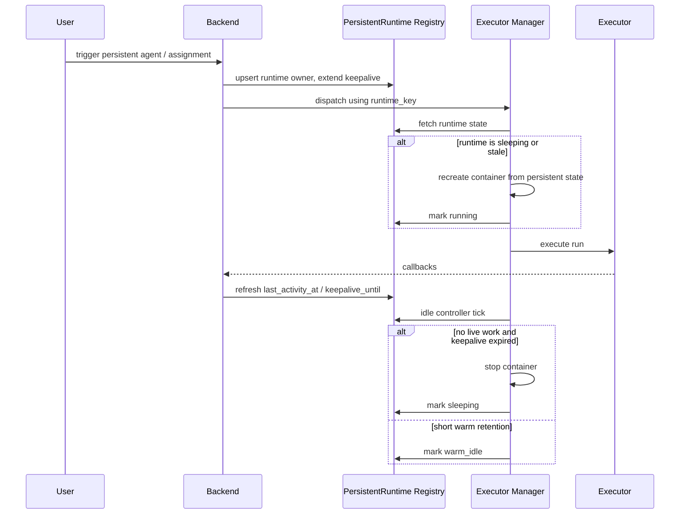

# 持久化 runtime 空闲停机与快速恢复决策

## 元数据

| 字段 | 值 |
| --- | --- |
| **决策日期** | 2026-05-30 |
| **关联 spec** | `specs/active/31-persistent-runtime-idle-lifecycle-plan.md`、`specs/research/2026-05-30-persistent-runtime-idle-lifecycle-research.md`、`specs/constitution/2026-05-04-server-channel-agent-persistence.md`、`specs/constitution/2026-05-07-agent-dispatch-latency-optimization.md` |

## 决策摘要

Poco 目前把一部分 agent 与 assignment 执行升级成了 `container_mode="persistent"`，但 persistent 语义仍然过度依赖“容器一直活着”。这会让空闲 runtime 持续占用计算资源，也让 manager 重启后的状态管理变得脆弱。

最终决定是：**persistent 的核心语义从“常驻容器”改为“可恢复的长期状态 + 可回收的活动计算”**。我们会新增统一的 `PersistentRuntime` 生命周期对象，把 server agent 和 `persistent_sandbox` assignment 的长期 runtime 都收敛到同一套状态机中；空闲后自动 stop 容器，保留 workspace、`/agent_state`、`sdk_session_id` 等恢复锚点；后续新任务到来时自动 resume。

## 背景

Poco 现有架构已经具备两个对这次决策很关键的前提。第一，长期状态边界已经成立：`agent_runtime_mode="persistent"` 时，executor_manager 会把真实 `/agent_state` 挂载到容器；`temporary` 时则使用只读 snapshot。第二，workspace 与 agent state 都落在宿主机持久目录，而不是只存在于容器可写层中。换句话说，系统并不需要依靠“容器永远不死”来维持长期状态。

问题在于，当前 lifecycle 还停留在“能复用，就一直复用”。`ContainerPool.on_task_complete()` 只会自动停掉 ephemeral 容器；persistent container 主要依赖显式 stop/remove/cancel 才会释放。对 server agent 来说，这意味着某个同事 agent 只要被 mention 过一次，就可能长期占住一份 executor。对 `persistent_sandbox` assignment 来说，则意味着一个已经结束工作的 issue 仍可能保留历史容器和端口映射。

这种设计在早期验证“二次响应更快”时是合理的，但随着 server agent、channel collaboration 和 persistent assignment 都越来越多，问题已经从“优化空间”变成“资源边界缺失”。如果继续把 `persistent` 等同于“容器常驻”，后续很难同时满足三件事：

- 让 agent / assignment 在空闲后释放计算资源；
- 让下一次触发仍然能恢复同一份长期上下文；
- 让前后端都能稳定看见 runtime 当前到底是热着、睡了、手动停了还是状态漂移了。

因此，这次不再把“容器是否仍在运行”当成 persistent 的定义，而是把 persistent 重新定义为一套**状态持久、计算可睡眠、任务到来可恢复**的运行时契约。

## 用户叙事

**Alice 在 server 的 `#backend` 频道里与 `@backend-specialist` 协作。**

1. Alice 第一次 `@backend-specialist` 时，系统为它拉起 persistent runtime。
2. Agent 完成当前回复后，短时间内保持 `warm_idle`，方便 Alice 连续追问。
3. 如果 15 分钟内都没有新的任务、reply 或显式 keep warm，runtime 会自动进入 `sleeping`，释放容器资源。
4. Alice 半小时后再次 `@backend-specialist`，系统会自动恢复同一个 runtime owner 对应的 workspace、`/agent_state` 和对话上下文，而不是新建一个陌生 agent。

**Bob 在 workspace issue 上使用 `persistent_sandbox` assignment。**

1. Bob 让 assignment 跑完一轮修改后离开页面。
2. Runtime 会在更长的 idle window 后自动睡眠，但 issue 仍然保留 session、workspace 和 assignment 记录。
3. Bob 第二天回来点击 `Retry` 或再次触发 assignment，系统会自动重启这个 runtime，而不是要求他手动先去 release 再重新创建。

**Carol 是 server owner，需要理解一个 agent 为什么现在不可用。**

1. Carol 打开 colleague detail，看到这个 agent 当前是 `sleeping`，而不是含糊的 `idle`。
2. 她可以手动 `Keep warm for 30m`、`Sleep now`，或显式 `Stop`。
3. 如果 runtime 状态漂移，例如 backend 认为它应该是热的，但 manager 找不到对应容器，UI 会显示 `stale`，并在下次触发时按 cold resume 处理。

## 最终决策

这次决策的核心是：**持久 runtime 的一等对象是“owner + state + lifecycle”，不是“一个永远开着的 Docker container”。**

- **产品决策**：`persistent` 不再等价于“常驻容器”，而等价于“长期状态可恢复、计算资源可回收、任务到来可自动恢复”。
- **产品决策**：server agent 与 `persistent_sandbox` assignment 都使用同一套 runtime lifecycle 语义，但允许配置不同的 idle policy。
- **产品决策**：自动睡眠是正常状态，不是失败或移除。用户需要能区分 `sleeping`、`manually_stopped` 和 `removed`。
- **UX / UI 决策**：runtime 状态对用户暴露为结构化 badge 和动作，而不是只显示低层 `runtime_status` 或 `container_id`。
- **技术决策**：新增统一的 `PersistentRuntime` registry，由 backend 持久化 runtime owner、lifecycle、keepalive 与最近活动时间；executor_manager 作为 controller 按该 registry 执行 stop/restart。
- **技术决策**：v1 只承诺 `stop + resume from persistent state`。`suspend/snapshot` 被视为未来优化，不是首版契约。

## 设计约束与不变量

- `agent_runtime_mode` 继续只负责 `/agent_state` 的读写边界；它不单独决定容器是否需要常驻。
- `container_mode="persistent"` 的 runtime owner 必须有稳定 runtime key，下一次恢复时要命中同一个 owner，而不是创建匿名新 runtime。
- 同一个 `AgentIdentity` 在任一时刻最多一个**可写** persistent runtime；自动睡眠不会打破这个约束。
- 自动睡眠不能发生在存在 blocking run、active queue item、进行中的 cancellation、或显式 keepalive lease 尚未到期时。
- 普通前端列表轮询、server 页面被动刷新、消息长轮询都不能自动延长 persistent runtime 的 keepalive。
- `sleeping` runtime 保留 workspace、`/agent_state`、session 记录和 `sdk_session_id`；释放的是容器、端口映射和进程内 client cache。
- `manually_stopped` 与 `sleeping` 必须区分：前者来自用户显式动作，后者来自 idle controller。
- server agent 进入 `manually_stopped` 后，普通 channel mention 不能把它自动拉起；必须经过显式 `Resume/Start`。
- `removed` 是 owner 生命周期语义；`sleeping` / `manually_stopped` 是 runtime lifecycle 语义。两者不能混用。

## 技术设计与结构边界

### 统一的 PersistentRuntime 注册表

新增 `PersistentRuntime` 作为 backend 中的长期运行时主表，而不是把这类状态散落在：

- `agent_persistent_states.runtime_status`
- `agent_assignments.container_id`
- executor_manager 进程内 `containers` / `session_to_container`

推荐主字段如下：

```text
persistent_runtimes
  id
  runtime_key
  owner_type              # server_agent | agent_assignment
  owner_id
  agent_identity_id
  assignment_id
  session_id
  container_id
  lifecycle_state         # running | warm_idle | sleeping | manually_stopped | stale | removed
  auto_resume
  idle_timeout_seconds
  warm_retention_seconds
  keepalive_until
  last_activity_at
  last_started_at
  last_stopped_at
  last_stop_reason
  worker_id
  browser_enabled
  filesystem_fingerprint
  metadata_json
```

其中：

- `AgentPersistentState` 继续代表长期私有状态目录。
- `PersistentRuntime` 代表“谁拥有这份长期计算上下文，以及它当前是热、温、睡还是停”。
- `AgentSession` / `AgentRun` 继续代表一次或多次对话/执行历史，但不再独自承担 runtime lifecycle 语义。

### 生命周期状态机

v1 对外暴露以下稳定语义：

| 状态 | 含义 |
| --- | --- |
| `running` | 容器存在，且当前有 live work，或者已经被拉起准备接收新任务 |
| `warm_idle` | 容器仍在，但当前没有 live work，处在短暂热保留窗口 |
| `sleeping` | 容器已 stop，长期状态保留；下次任务可自动恢复 |
| `manually_stopped` | 用户显式停止；只有显式 resume，或 owner 范围内的明确运行操作（如 assignment retry/trigger）才应拉起；普通频道 mention 不会隐式解除 manual stop |
| `stale` | registry 认为应有热 runtime，但 manager / Docker 无法验证；下次按 cold resume 处理 |
| `removed` | owner 已被移除，不再允许继续自动调度 |

`failed` 不作为 runtime lifecycle 主状态；失败属于 run/session 终态，最多体现在 runtime summary 的附加信息上。

### 数据流



### 后端职责

- runtime registry 的 source of truth 在 backend，而不是 executor_manager。
- enqueue / trigger / callback / cancel / remove 等业务动作都通过 service 层刷新 runtime lifecycle。
- server agent 和 assignment 的 API 默认返回 runtime summary，而不是要求前端自行拼装 `container_id + runtime_status + active_session_id`。
- 对 removed agent 或 released assignment，backend 要负责把 runtime 标记为 `removed`，并阻断后续自动恢复。

### Executor Manager 职责

- ContainerPool 继续负责容器创建、挂载与 stop。
- 但 ContainerPool 不再是 persistent runtime 生命周期的 source of truth，而是受 backend runtime registry 驱动。
- 新增 idle controller，周期性判断哪些 runtime 可以从 `running/warm_idle` 切到 `sleeping`。
- manager 重启后应能通过 runtime registry 和 Docker labels 重新建立映射，而不是只依赖进程内内存。

### 前端职责

- server colleagues 与 assignment 面板展示统一 runtime summary。
- 用户可以看到 `sleeping` 和 `manually_stopped`，并执行 `Keep warm`、`Sleep now`、`Resume` 这类动作。
- 不把“当前页面一直开着”默认为 keepalive；若产品要支持 presence-based keepalive，必须通过显式短时 lease 接口实现。

## 备选方案简述

- **方案 A：保持当前 persistent container 永远常驻。**
  没选，因为它只解决恢复快，不解决资源利用率，也让 runtime 生命周期不可见。

- **方案 B：只在 executor_manager 进程内做 TTL stop。**
  没选，因为状态跨重启不稳，也无法让 backend/frontend 理解 `sleeping`、`manually_stopped`、`stale` 的区别。

- **方案 C：首版直接做 suspend/snapshot。**
  没选，因为它把范围从 lifecycle 控制扩大到更底层的运行时快照能力，复杂度明显高于首版所需。

## 约束与前提

- 当前设计建立在宿主机 workspace 和 `/agent_state` 已经是稳定持久目录的前提上。
- `sdk_session_id` 仍由 backend/session 持久化；容器重建后可以继续作为恢复对话上下文的锚点。
- v1 不处理多 executor_manager 分布式一致性，只要求单 manager 重启后可恢复 runtime 映射。
- v1 不要求对 Docker 之外的 runtime 抽象做统一适配；如果未来接入 Kubernetes、Firecracker 或 remote runner，再扩展 controller 实现。

## 历史变更

| 日期 | 变更内容 | 原因 |
| --- | --- | --- |
| 2026-05-30 | 初次记录 | 调研 persistent runtime 空闲调度后，固化“状态持久、计算可睡眠、任务到来可恢复”的统一方向 |
