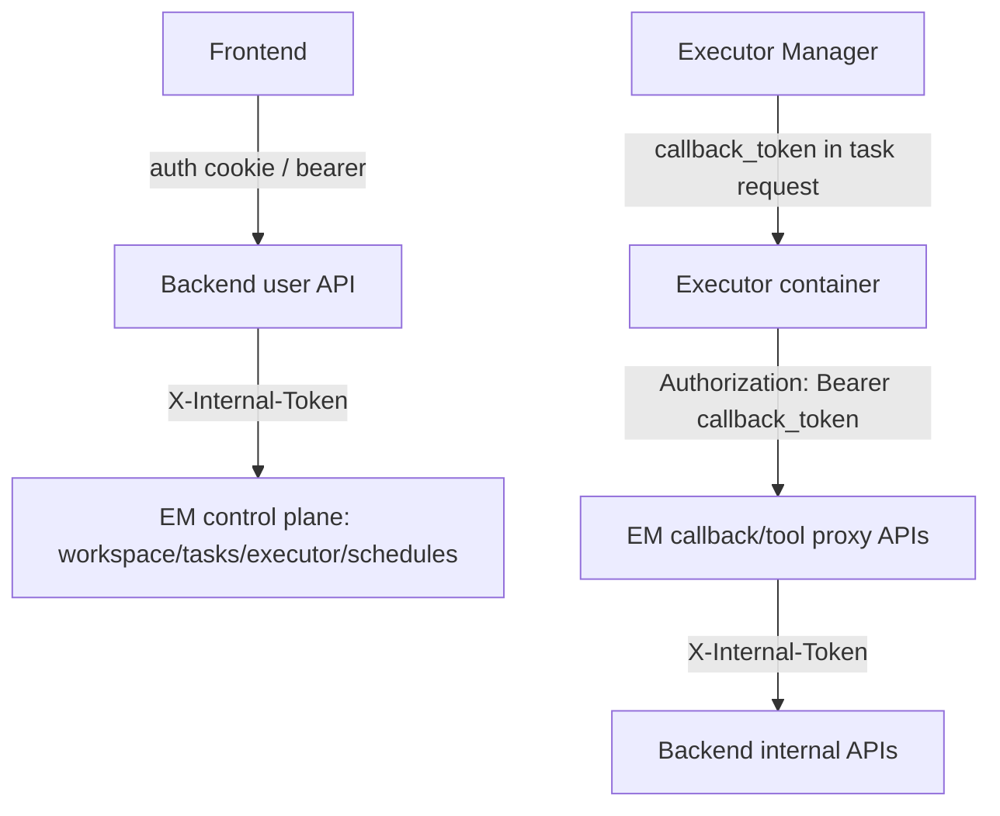

# Executor Manager API 鉴权边界决策

## 元数据

| 字段 | 值 |
| --- | --- |
| **决策日期** | 2026-06-11 |
| **关联 spec** | `specs/active/33-executor-manager-workspace-authorization-hardening-plan.md` |
| **关联 issue** | `poco-ai/poco-claw#133` |

## 决策摘要

`poco-ai/poco-claw#133` 直接暴露的问题是 Executor Manager 的 `/api/v1/workspace/*` 接口没有鉴权，调用方只要能访问 EM，就可以把 URL 里的 `user_id` 换成别人并读取、列举、归档或删除对应执行 workspace。

进一步检查后，EM 还有一些非 health 接口也没有 HTTP 层 token。最终决定是：**EM 除健康检查外，所有接口都必须明确属于某一类受信调用方，并使用对应 token**。

第一类是 Backend 或内部服务调用 EM 的控制面接口，统一使用 `X-Internal-Token`。第二类是 executor container 回传进度、截图、memory、channel tool 调用等执行器回传/工具代理接口，统一使用 `Authorization: Bearer <callback_token>`。Backend 面向用户的 `/sessions/{session_id}/workspace/*` 和 `/runs/{run_id}/workspace/*` 接口保持现状，不迁移到 EM，也不改变前端 Artifacts 体验。

## 背景

当前 Poco 的服务边界大致是：

- Frontend 调 Backend 用户态 API；
- Backend 用用户登录态做业务鉴权，并用 `X-Internal-Token` 调内部接口；
- Executor Manager 负责调度、容器管理、workspace 管理，并把 executor container 的回调转发给 Backend；
- Executor container 通过 EM 提交 callback、截图、memory 和 channel runtime tool 请求。

Backend 用户态 workspace API 本身已有 owner check。例如 `/api/v1/sessions/{session_id}/workspace/files` 会先解析当前用户，再校验 `AgentSession.user_id`。所以 issue #133 的核心不是 Backend 用户接口，而是 EM 的 live workspace 接口。

EM 当前存在三种接口状态：

- 已经走 `X-Internal-Token`：例如 `/api/v1/internal/runs/notify`。
- 已经走 callback token：例如 `/api/v1/skills/submit`。
- 还没有 HTTP token：例如 `/api/v1/workspace/*`、`/api/v1/tasks`、`/api/v1/executor/*`、`/api/v1/schedules`、`/api/v1/callback`、`/api/v1/computer/screenshots`、`/api/v1/memories`、`/api/v1/agent-channel-*`、`/api/v1/user-input-requests`。

由于 `docker-compose.yml` 默认把 EM `8001` 映射到宿主机端口，不能把“它理论上只给内部服务用”当成代码层面的安全保证。即使部署上应避免公网暴露，代码也应该做到 fail closed。

## 用户叙事

**Alice 是普通用户，在页面里查看 agent 产物。**

1. Alice 打开 Artifacts 面板。
2. Frontend 继续调用 Backend `/api/v1/sessions/{session_id}/workspace/files`。
3. Backend 校验 Alice 是否拥有该 session，再返回文件树和预览 URL。
4. Alice 的体验不变，不需要知道 EM 地址，也不能直接访问 EM workspace 文件。

**Bob 是外部调用者，能打到 EM 端口。**

1. Bob 请求 `/api/v1/workspace/file/alice/{session_id}?path=secrets.txt`。
2. 因为请求没有 `X-Internal-Token`，EM 返回 `403`。
3. Bob 即使知道 `user_id/session_id/path`，也不能绕过 Backend 用户态授权。

**Backend 需要创建任务或删除容器。**

1. Backend 调 `/api/v1/tasks` 或 `/api/v1/executor/delete`。
2. 请求必须带 `X-Internal-Token`。
3. EM 只接受与自身配置一致的内部 token。

**Executor container 需要回传执行信息。**

1. EM dispatch 任务时把 `callback_token` 传给 executor。
2. Executor 调 `/api/v1/callback`、`/api/v1/computer/screenshots`、`/api/v1/memories` 或 `/api/v1/agent-channel-*` 时带 `Authorization: Bearer <callback_token>`。
3. EM 只接受合法 callback token，再把请求转发给 Backend internal API。

## 最终决策

这次决策的核心是：**EM 不是用户态入口。EM 的非 health API 必须按调用方类型显式鉴权。**

- **产品决策**：用户态文件浏览、archive 下载、share link、share to channel 的入口继续在 Backend；正常用户体验不变。
- **技术决策**：内部控制面接口使用 `X-Internal-Token`，包括 `/workspace/*`、`/tasks`、`/executor/*`、`/schedules`。
- **技术决策**：执行器回传/工具代理接口使用 `Authorization: Bearer <callback_token>`，包括 `/callback`、`/computer/screenshots`、`/memories`、`/agent-channel-*`、`/user-input-requests`。
- **技术决策**：`/internal/runs/notify` 保持 `X-Internal-Token`；`/skills/submit` 保持 callback token。
- **技术决策**：v1 不引入 session-scoped workspace capability。这个可以作为后续更细粒度加固，但不是当前 issue 的第一优先级。
- **技术决策**：`user_id`、`session_id`、`path` 都只能作为业务参数，不能替代 token 鉴权。

## 设计约束与不变量

- EM 只保留 `/api/v1/health`、`/api/v1/` 这类健康/状态接口无 token；其他接口必须有 token。
- Backend 调 EM 控制面时必须带 `X-Internal-Token`。
- Executor 调 EM 回传/工具代理接口时必须带 callback token。
- 不要把所有 EM 接口一刀切成 `X-Internal-Token`，否则 executor container 现有调用链会断。
- 不要把所有 EM 接口一刀切成 callback token，控制面接口仍应只允许 Backend/internal service。
- Frontend 不直接访问 EM。
- Backend 用户态接口继续使用登录态和 session/run owner check。
- `/api/v1/workspace/*` 即使加了 internal token，也不能把 URL 中的 `user_id` 当作用户身份；后续可继续收敛 legacy `{user_id}/{session_id}` 路径。
- `INTERNAL_API_TOKEN` 和 `CALLBACK_TOKEN` 在生产环境不能使用默认值。

## 技术设计与结构边界

### EM API 分类

| 接口 | 调用方 | 鉴权方式 | 说明 |
| --- | --- | --- | --- |
| `/api/v1/health`、`/api/v1/` | health check / service discovery | 无 token | 只返回服务状态 |
| `/api/v1/internal/runs/notify` | Backend | `X-Internal-Token` | 已符合目标状态 |
| `/api/v1/workspace/*` | Backend / internal admin | `X-Internal-Token` | issue #133 核心修复面 |
| `/api/v1/tasks` | Backend | `X-Internal-Token` | 创建/查询任务，属于控制面 |
| `/api/v1/executor/*` | Backend / internal admin | `X-Internal-Token` | cancel/delete/load，属于控制面 |
| `/api/v1/schedules` | Backend | `X-Internal-Token` | 当前由 Backend proxy 给前端展示 |
| `/api/v1/callback` | Executor container | callback token | agent 进度/状态回传 |
| `/api/v1/computer/screenshots` | Executor container | callback token | 浏览器截图上传 |
| `/api/v1/memories` | Executor container | callback token | memory tool proxy |
| `/api/v1/agent-channel-*` | Executor container | callback token | channel runtime/artifact/task tool proxy |
| `/api/v1/user-input-requests` | Executor container | callback token | user-input tool proxy |
| `/api/v1/skills/submit` | Executor helper | callback token | 已符合 v1 目标状态 |

### 内部控制面

控制面接口统一依赖 `require_internal_token`。同时需要补齐调用方：

- `backend/app/services/executor_manager_client.py` 调 `/api/v1/executor/delete` 时带 `X-Internal-Token`。
- `backend/app/api/v1/schedules.py` proxy `/api/v1/schedules` 时带 `X-Internal-Token`。
- 创建任务的 Backend 调用路径如果仍走 `/api/v1/tasks`，也必须带 `X-Internal-Token`。

### Executor 回传和工具代理

回传/工具代理接口统一依赖 `require_callback_token`。同时需要补齐 executor 侧 client：

- `executor/app/core/callback.py` 的 `CallbackClient` 带 `Authorization: Bearer <callback_token>`。
- `executor/app/core/computer.py` 的 `ComputerClient` 带 callback token。
- `executor/app/core/memory.py` 的 `MemoryClient` 带 callback token。
- `executor/app/core/channel_runtime.py` 的 `ChannelRuntimeClient` 带 callback token。
- `executor/app/core/user_input.py` 的 `UserInputClient` 带 callback token。
- `executor/app/api/v1/task.py` 在构造这些 client 时传入 `req.callback_token`。

### Backend 用户态入口

Backend 用户态接口不是本次问题的根源，保持现有职责：

1. 从 cookie/bearer token 解析用户。
2. 查 session/run。
3. 校验 owner 或明确的协作权限。
4. 授权通过后读取 workspace export manifest 或生成 presigned URL。

### 数据流

## 备选方案简述

- **只给 `/workspace/*` 加 token。**
  能修 issue #133，但 EM 其他控制面和回传接口仍然裸露，后续还会有类似问题。

- **所有 EM 接口都用 `X-Internal-Token`。**
  不采用。Executor container 当前拿的是 callback token，回传/工具代理接口应该用 callback token，否则要把 internal token 暴露给 executor。

- **所有 EM 接口都用 callback token。**
  不采用。`/tasks`、`/executor/delete`、`/workspace/delete` 这类控制面能力不应该交给 executor token。

- **直接做 session-scoped capability。**
  暂不作为 v1。它更细，但会扩大实现范围；当前先统一两类既有 token，把裸接口关闭。

## 约束与前提

- `CALLBACK_TOKEN` 已经通过 EM dispatch 传给 executor，适合作为 executor -> EM 回传鉴权凭证。
- `INTERNAL_API_TOKEN` 已经用于 Backend/EM 内部接口，适合作为 Backend -> EM 控制面鉴权凭证。
- 生产部署仍应避免公网暴露 EM 8001；代码鉴权不是网络隔离的替代品。

## 历史变更

| 日期 | 变更内容 | 原因 |
| --- | --- | --- |
| 2026-06-11 | 初次记录 | 针对 `poco-ai/poco-claw#133` 和 EM 裸接口盘点，固定两类 token 的 API 鉴权边界 |
| 2026-06-11 | 实现完成 | 按两类 token 边界落地 EM 路由鉴权、Backend internal header、Executor callback token header，并保留 Backend 用户态 workspace 入口 |
