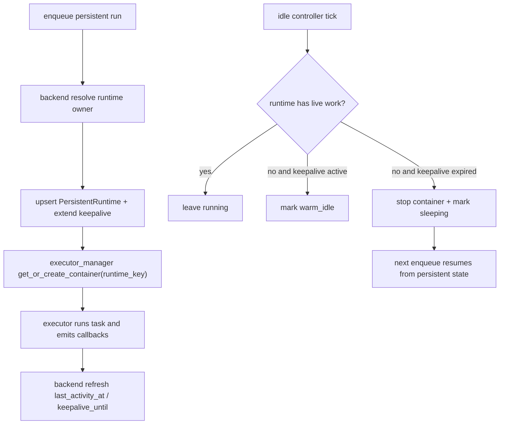

# 持久化容器空闲调度与快速恢复策略调研

## 元数据

| 字段 | 值 |
| --- | --- |
| **创建日期** | 2026-05-30 |
| **研究领域** | architecture-evolution / technology-evaluation |
| **关联 spec** | `specs/constitution/2026-05-30-persistent-runtime-idle-lifecycle.md`、`specs/active/31-persistent-runtime-idle-lifecycle-plan.md`、`specs/constitution/2026-05-04-server-channel-agent-persistence.md`、`specs/constitution/2026-05-07-agent-dispatch-latency-optimization.md` |
| **状态** | concluded |

## 课题描述

Poco 当前已经把一部分执行场景升级到了 `container_mode="persistent"`：server agent 的频道触发、agent collaboration，以及 workspace issue 上的 `persistent_sandbox` assignment 都会尽量复用同一个容器。这个设计解决了“二次触发还要重新拉起整套执行环境”的冷启动问题，但它把另一个问题放大了出来：persistent container 一旦被创建，就几乎没有自动回收路径，会持续占用 CPU、内存、端口和 Docker bookkeeping。

从代码观察看，Poco 已经具备“状态与计算分离”的雏形：`executor_manager/app/services/container_pool.py` 会根据 `agent_runtime_mode` 决定把 `/agent_state` 以 `rw` 还是 `ro` 挂载；`executor_manager/app/services/workspace_manager.py` 也会把 session workspace 和 agent state 目录持久化到宿主机目录。这意味着系统并不需要把“长期状态”和“长期运行的容器”绑死在一起。真正缺的，是一套面向 persistent runtime 的 idle 检测、自动 stop、按需恢复和保活租约机制。

这份调研要回答三个问题：

1. 业界成熟系统是如何实现“空闲后自动让出计算资源，但下次能快速恢复”的？
2. 它们通常把哪些能力拆开建模，哪些反模式需要避免？
3. Poco 在现有 `backend -> executor_manager -> executor` 架构下，最值得借鉴的实现路径是什么？

## 调研方法

- 代码审查：梳理 Poco 当前 persistent runtime 的创建、复用、停止、状态同步与 workspace 清理路径。
- 现状对照：对比 `agent persistent state`、session workspace、container lifecycle 三者在当前代码中的边界。
- 官方资料调研：阅读 Knative、KEDA、Fly Machines、GitHub Codespaces、JupyterHub 的官方文档，聚焦 scale-to-zero、cooldown、idle culler、warm pool 和快速恢复策略。

## 发现与分析

### 发现 1: Poco 已经把“长期状态”和“活动计算”部分分离，但 persistent container 仍缺少自动 eviction

当前实现已经有三个对后续演进非常关键的事实：

1. `executor_manager/app/services/container_pool.py` 会为 `agent_runtime_mode="persistent"` 的 agent 挂载真实 `/agent_state`，为 `temporary` 模式挂载只读 snapshot。这意味着 agent 的长期状态边界并不依赖容器常驻。
2. 同一个 persistent agent 的容器 key 已经是稳定的。`_resolve_agent_container_id()` 会把 `agent_identity_id` 映射成稳定的 `agent-<id-prefix>`，而不是每次重新分配随机容器。
3. session workspace 和 agent state 已经落在宿主机持久目录下；容器只是挂载和执行载体。

但与此同时，当前回收路径明显不完整：

- `ContainerPool.on_task_complete()` 只会在 `container_mode="ephemeral"` 时停止容器。
- persistent container 目前主要依赖手动删除、session cancel，或 remove/stop agent 这类显式操作回收。
- `CleanupService` 只会定时清理 workspace，不负责 persistent container lifecycle。
- `TaskDispatcher.get_container_pool()` 和 `ContainerPool.containers/session_to_container` 主要是进程内内存映射；manager 重启后虽然能通过 Docker label 兜底 cancel，但没有系统化的 runtime registry。

结果是：Poco 现在的“persistent”更接近“只要不手动停，就永远热着”，而不是“状态持久、计算可回收、下次自动恢复”。

### 发现 2: 成熟系统会把“多久后缩容到 0”“最后一个实例再保留多久”“缩容采样频率”拆成独立旋钮

KEDA 和 Knative 都没有把 idle scheduling 压缩成一个模糊的“timeout”。

- KEDA 的 `ScaledObject` 规范明确区分了 `pollingInterval`、`cooldownPeriod`、`initialCooldownPeriod` 和 `idleReplicaCount`，并且允许通过 HPA `behavior.scaleDown.stabilizationWindowSeconds` 控制缩容抖动。[KEDA ScaledObject spec](https://keda.sh/docs/2.16/reference/scaledobject-spec/)
- Knative Serving 则把 `scale-to-zero-grace-period` 和 `scale-to-zero-pod-retention-period` 分开：前者控制系统在允许真正缩到 0 之前预留多少时间，后者控制最后一个 pod 在没有流量后还能额外保留多久。[Knative scale to zero](https://knative.dev/v1.19-docs/serving/autoscaling/scale-to-zero/)

这类设计的共同点是：

- **检测频率** 不等于 **停止阈值**。
- **刚创建出来的实例** 往往需要一个 `initial cooldown`，避免“刚热起来就被杀掉”。
- **最后一个热实例** 可以有一段更短的保留窗口，用来吸收抖动式流量或连续对话。

对 Poco 的启发是：不要只新增一个 `idle_timeout_seconds` 然后把所有语义都塞进去。至少应区分：

- controller 扫描周期
- 空闲判断窗口
- completion 之后的 warm retention
- 显式 keepalive lease 到期时间

### 发现 3: 优秀系统会把“自动唤醒路径”和“最小热实例数”建模成一等能力

Fly Machines 的自动启停文档说明了两件很适合 Poco 借鉴的事：

- 服务可以在空闲时自动 `stop` 或 `suspend`，并在后续请求到来时自动唤醒。
- 可以通过 `min_machines_running` 保留最小热实例数，而不是把所有实例都常驻。
- `suspend` 的恢复通常比完全 `stop` 更快，但它不是总能成功的通用契约；系统仍然要接受回退到普通 cold start 的现实。[Fly Machines autostop/autostart](https://fly.io/docs/launch/autostop-autostart/)

这里最重要的不是 Fly 的具体 API，而是它把三个概念区分得很清楚：

- **是否允许自动休眠**
- **请求/任务到来时是否自动恢复**
- **最少需要保留几个热实例**

Poco 现在只有“persistent container 尽量复用”这一种语义，还没有表达“这个 runtime 可以自动睡眠，但下次任务到来时自动热启动”的中间状态。后续设计里，`sleeping` 应该成为一等状态，而不是把“容器已经被 stop 了”错误地等同于“runtime 被删除了”。

### 发现 4: 快速恢复依赖持久状态边界，而不是无限期保活

GitHub Codespaces 的官方文档说明，codespace 在超过用户设置的 idle timeout 后会停止，但用户的改动不会因为 stop 而丢失；后续可以重新启动同一个 stopped codespace 继续工作。[GitHub Codespaces timeout](https://docs.github.com/en/codespaces/setting-your-user-preferences/setting-your-timeout-period-for-github-codespaces) 这类模型的核心不是“容器永远不关”，而是：

- 工作目录和开发状态有稳定的持久边界；
- stop 只是释放活动计算资源；
- resume 是恢复同一份持久状态，而不是新开一份完全无关的环境。

Fly 的 `suspend` 进一步说明了一点：更快的 resume 常常依赖更重的底层优化（例如 snapshot），但系统 API 契约不应该建立在“snapshot 一定可用”的理想前提上。对 Poco 来说，v1 最稳妥的契约应当是：

- `stop + restart from persistent state` 是必保路径；
- `suspend + faster resume` 是未来可选优化，不应成为首版的前提。

### 发现 5: 预热和保活不应该等价于“所有 runtime 永远热着”

JupyterHub 的运维优化文档非常适合拿来对照 Poco 当前的问题：

- 它提供了 idle culler，用于清理空闲用户 server。
- 它提供 continuous image puller 和 user placeholder pods，用于减少真正需要启动用户 server 时的冷启动成本。
- 它甚至建议把 placeholder pod 和真正用户 server 放到不同优先级和调度策略上，而不是用“大量永远热着的真实用户 pod”硬扛延迟。[Zero to JupyterHub optimization](https://z2jh.jupyter.org/en/3.0.1/administrator/optimization.html)

这类策略背后的经验是：

- “让全部真实工作容器一直热着”通常是最贵且最难扩展的方案；
- 更合理的方式是：保留少量 warm buffer，或者提前把镜像/依赖准备好；
- 真正的用户工作容器仍然应该在空闲时被回收。

Poco 当前已经通过 persistent workspace、persistent `/agent_state` 和 image 复用拿到了一部分“恢复基础”。首版没有必要引入通用 warm pool；但“保活只针对少数高价值 runtime，其他默认自动睡眠”这个方向应该成为明确决策。

### 发现 6: Poco 需要的是“带租约的 runtime lifecycle controller”，而不是单纯的 manager 侧 TTL stop

如果只在 `ContainerPool` 里补一个“超过 30 分钟就 stop”逻辑，会留下几个问题：

- activity 信号太单一，只能看到“上次创建容器是什么时候”，看不到 session queue、callback、agent stop/remove、manual keep warm 等高层语义；
- 状态不可见，backend 和 frontend 无法稳定区分 `running`、`sleeping`、`manually_stopped`、`stale`；
- manager 重启后内存映射丢失，TTL 逻辑仍然容易漂移；
- 不同 persistent runtime owner（server agent、persistent sandbox assignment）无法配置不同 idle policy。

因此更合理的路径是：在 backend 侧引入持久化的 runtime registry，把“runtime 是谁的、当前生命周期状态是什么、最近活动时间是什么、keepalive 什么时候过期、是否允许自动恢复”建模成数据库记录；executor_manager 则成为 controller，按 registry 驱动 stop/restart。

## 方案比较

| 方案 | 描述 | 优点 | 主要问题 |
| --- | --- | --- | --- |
| A | 保持现状，persistent container 一直常驻 | 最简单，无需改协议 | 资源长期占用，manager 重启后状态漂移，缺少自动恢复/睡眠语义 |
| B | 仅在 executor_manager 内做固定 TTL stop | 改动较小 | 状态不可见，无法表达 keepalive / manual stop / stale reconciliation，跨重启不稳 |
| C | backend runtime registry + idle controller + auto resume | 状态清晰，可观测，可按 owner 定制策略，和现有 state boundary 一致 | 需要跨 backend / manager / frontend 协同改造 |
| D | 直接做 suspend/snapshot first | 恢复最快 | 依赖更重的底层能力，错误恢复复杂，不适合作为 v1 前提 |

**推荐：方案 C，保留 D 作为后续优化方向。**

## 对 Poco 的直接借鉴

### 1. 先把“persistent”从“常驻计算”改成“可恢复的长期状态 + 可回收的计算”

这和当前代码边界是匹配的。`/agent_state`、session workspace、`sdk_session_id` 都已经能承担“恢复锚点”的角色；差的是 runtime lifecycle，而不是长期状态本身。

### 2. 采用分层状态机，而不是二值的 running / stopped

建议 v1 公开语义至少包含：

- `running`：容器存在，且当前有 active work 或可立即接活。
- `warm_idle`：容器仍在，但当前没有 live work，处在短暂保留窗口。
- `sleeping`：容器已 stop，workspace 和 `/agent_state` 仍保留；新任务到来时允许自动恢复。
- `manually_stopped`：用户显式停止；系统不应因为被动轮询或普通 keepalive 自动拉起。
- `stale`：backend 记录认为应该热着，但 manager 或 Docker 无法确认；下次使用按 cold resume 处理。

### 3. keepalive 必须是有边界的 lease，而不是前端任何一次轮询都算“活跃”

建议把可延长保活的来源限制为：

- 新 run 入队 / claim / running callback；
- 显式 “Keep warm for N minutes” 操作；
- 有明确 owner 语义的交互会话，例如进入 colleague detail 或 issue assignment detail 后创建的短时 presence lease；
- 运维级 schedule window（例如 nightly 批量任务前预热）。

不建议把普通列表轮询、消息刷新、server 页面停留都视为有效保活，否则 persistent runtime 会再次退化成“只要前端在刷就永远不睡”。

### 4. v1 直接做 stop/resume，暂不把 suspend 作为硬依赖

Poco 现有基建最适合先把以下路径做扎实：

1. idle controller 判断可睡眠；
2. manager stop/remove container；
3. runtime registry 状态切到 `sleeping`；
4. 下次 enqueue 同 owner 的 persistent run 时，根据 runtime key 重建容器；
5. executor 继续使用持久 workspace、`/agent_state`、`sdk_session_id` 恢复上下文。

这条路径已经能满足“让出计算资源，同时后续迅速恢复工作”的主目标。

### 5. 不为所有 runtime 保持常热，只为少数高价值 runtime 提供受控保活

建议首版策略：

- server agent 默认允许自动睡眠，warm retention 较短；
- `persistent_sandbox` assignment 默认允许自动睡眠，但 idle timeout 比 agent 更长；
- 真正需要持续热着的少数 runtime，通过显式 keepalive / pin，而不是全局默认常驻；
- 暂不引入全局 warm pool；如果后续冷启动仍然是主痛点，再评估 image pre-pull、small warm buffer 或 suspend。

## 对 Poco 的建议架构

### 推荐的核心对象

建议新增一层通用 `PersistentRuntime` 注册表，作为 backend 的 source of truth：

- `runtime_key`：稳定标识某个长期 runtime，例如 `server_agent:<agent_identity_id>`、`assignment:<assignment_id>`
- `owner_type / owner_id`
- `container_id`
- `lifecycle_state`
- `last_activity_at`
- `keepalive_until`
- `idle_timeout_seconds`
- `warm_retention_seconds`
- `auto_resume`
- `last_started_at / last_stopped_at / last_stop_reason`
- `worker_id`
- `browser_enabled / filesystem_fingerprint / metadata_json`

这样 `AgentPersistentState` 继续只负责“长期状态目录”，`PersistentRuntime` 负责“活动计算生命周期”，两者不再混用。

### 推荐的控制循环

### 推荐的首版默认策略

这不是项目级永恒常量，而是建议的初始 rollout 值：

- idle controller 每 60 秒扫描一次；
- server agent `warm_retention_seconds = 120`，`idle_timeout_seconds = 900`；
- persistent assignment `warm_retention_seconds = 300`，`idle_timeout_seconds = 1800`；
- 手动 keepalive 默认上限 30 分钟，服务端硬上限 2 小时；
- `min_warm_runtimes = 0`，首版不引入全局 warm floor。

这些数值背后的思路是：先把“释放资源”和“可恢复”两件事跑通，再用观测数据决定是否需要更激进的预热。

## 小结

Poco 当前真正的问题不是“还没做 persistent”，而是“persistent 只做了保留，没有做调度”。成熟系统普遍采用的做法不是让每个长期 runtime 永远热着，而是：

- 把长期状态和活动计算分开；
- 用明确的 cooldown / retention / keepalive lease 建模空闲生命周期；
- 在 stop 后保留恢复锚点；
- 通过少量预热和自动唤醒来控制延迟，而不是无上限保活。

对 Poco 来说，最值得借鉴的不是某一个平台的具体 API，而是这套分层思路。首版最合适的落地形态是：**backend 维护 persistent runtime registry，executor_manager 维护 idle controller 和 stop/restart，frontend 暴露 sleeping / keep warm / stop now 这些可解释的状态与动作。**

## 参考资料

- [Knative Serving: Scale to zero](https://knative.dev/v1.19-docs/serving/autoscaling/scale-to-zero/)
- [KEDA: ScaledObject specification](https://keda.sh/docs/2.16/reference/scaledobject-spec/)
- [Fly.io: Autostop and autostart Machines](https://fly.io/docs/launch/autostop-autostart/)
- [GitHub Codespaces: Set your timeout period](https://docs.github.com/en/codespaces/setting-your-user-preferences/setting-your-timeout-period-for-github-codespaces)
- [Zero to JupyterHub: Optimization](https://z2jh.jupyter.org/en/3.0.1/administrator/optimization.html)
